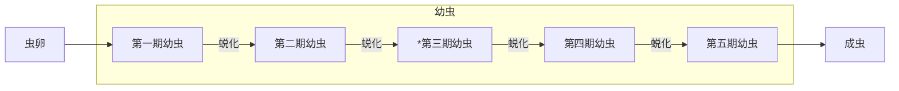
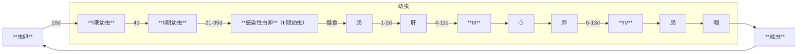
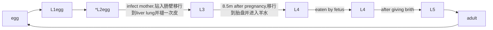
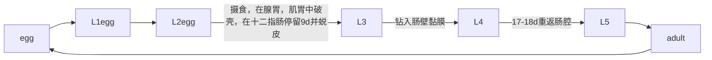
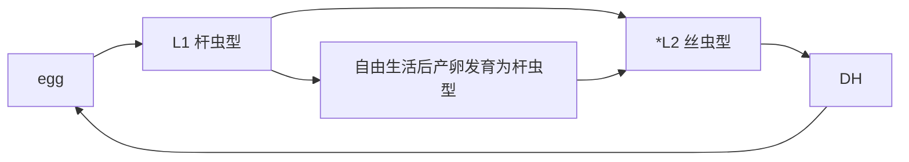
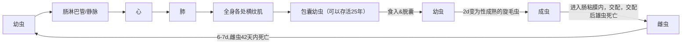
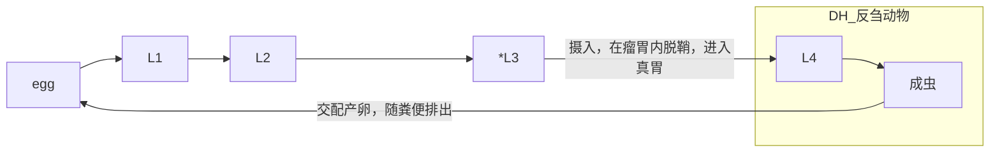

# 概论
## 线虫形态
### 成虫
- 线形/圆柱形，体表光滑，两侧对称，不分节，前端钝圆，后端逐渐变细
- 雌雄异体
  - 雌虫较大，尾端尖直，略向腹面弯曲，生殖系统大多为双管形
  - 雄虫较小，尾端弯曲呈钩状或膨大呈伞状，生殖系统通常为单管形
- 线虫成虫有完整的消化道和假体腔/原体腔 ***primary coelom***
  - **消化系统**（完全的消化道）：包括口，口腔，咽管，中肠，直肠，肛门等。有些虫种，口腔角皮覆盖加厚，构成硬齿或切板，口腔变大，称为口囊（buccal capsule）
  - **生殖系统** 
    - 雄性生殖系统单管型，由睾丸，输精管，储精囊和射精管相连而成，尾端多具单一/成对的交合刺
    - 雌性生殖系统多为双管型，分别由卵巢，输卵管，受精囊和子宫组成
  - **排泄系统** 一般有一对长排泄管
    - 无尾感器亚纲 腺型
    - 尾感器亚纲 管型
      - H型 
      - U型
      - 倒U型
  - **神经系统** 咽部神经环是神经系统的中枢
    - 向前发出三对神经干，支配口周感觉器官
    - 向后发出背，腹及两侧共3-4对神经干，包埋于于皮下层/纵索，分别控制虫体的运动和感觉
    - 主要感觉器官
      - 乳突
      - 头感器
      - 尾感器
      - 部分虫种缺乏尾感器
        - 无尾感器亚纲
          - 旋毛虫
          - 鞭虫
          - 肝毛细线虫
          - 肾膨节线虫
- 头部 
  - 蛔虫 具有三片唇
  - 钩虫 具有口囊，口囊内有切板
  - 结节虫 具有叶冠，头泡和侧翼膜
  - 捻转血矛线虫 头部两侧有一对颈乳突
  - 旋形华首线虫 头部有四条波浪型饰带
  - 肾虫 头部有头感器
- 体壁
  - 由角皮，皮下层和纵肌层组成
- 虫卵
  - 无卵盖，一般为卵圆形，卵壳多为淡黄色，棕黄色或无色

## 线虫发育
### 基本概念
- 卵生
- 卵胎生
- 胎生
- 感染性虫卵
- 感染性幼虫
- 披鞘幼虫 指幼虫第二次蜕皮时，旧角皮不蜕掉仍留在幼虫上
- 蜕皮
### 发育史

### 生活史
#### 土源性线虫
- 不需要中间宿主，称为直接发育型direct life cycle
- 感染性虫卵/幼虫可直接进入人体发育，肠道线虫多属此型
#### 生物源性线虫
- 需要中间宿主，称为间接发育型indirect life cycle
- 组织内寄生线虫多属此型 
## 线虫致病作用
- 虫荷parasitic burden 宿主体内寄生虫数量
- 幼虫 移行导致组织/器官损害
  - 钩虫感染期幼虫 皮炎
  - 蛔虫/钩虫幼虫 肺部损害，甚至蛔虫/钩虫性哮喘
  - 旋毛虫幼虫 寄生于肌肉内 肌炎，全身性症状
  - 犬猫寄生线虫幼虫进入人体 皮肤/内脏幼虫移行症
- 成虫 通常组织内寄生线虫对人体危害较肠道线虫严重
  - 摄取营养 营养不良
  - 机械性损害 组织损伤，出血
  - 化学性刺激 炎症
  - 免疫病理反应 炎症
  - ex
    - 旋毛虫幼虫 心肌炎，心包积液，心力衰竭以至死亡
    - 广州管圆线虫寄生于神经系统造成脑脊髓严重损害
## 线虫分类
### 线形动物门phylum nematoda
#### 尾感器亚纲
- 杆形目
- 圆形目
- 蛔目
- 尖尾目
- 旋尾目
- 驼形目
- 丝虫目
#### 无尾感器亚纲
- 毛尾目
- 膨结目/毛首目

# 寄生线虫病
## 蛔虫病
### 猪蛔虫病
#### 病原及其分类地位
- 猪蛔虫 蛔科 蛔属
#### 病原特征
##### 成虫
- 大小 大型虫体
- 颜色 淡红色/淡黄色
- 形状 圆柱形
- 雄虫 较短 尾弯曲似鱼钩，泄殖腔尾有一对交合刺
- 雌虫 较长，尾直无钩
- 头部 三片唇，排列为品字形，每唇上有乳突
- 尾部
  - 雄虫弯曲，无交合伞，有两个等长的**交合刺**及**尾乳突**
  - 雌虫尾部尖而直，雌虫为双管型，阴门开口于虫体前1/3与中1/3交界处
##### 虫卵
- 受精卵 椭圆形
- 未受精卵 长椭圆形
#### IH
#### DH 猪
#### 寄生部位
- 小肠
#### 生活史

#### 流行病学
- 3-5m小猪最易感，症状最严重
- 繁殖力强
- 虫卵抗逆性强
#### 病理变化
- 幼虫
  - 移至肝脏引起肝组织出血，变性和坏死，肝表面形成云雾状蛔虫斑--**乳斑肝**
- 成虫
  - 夺取营养
  - 堵塞胆管 黄疸
  - 堵塞肠管
  - 毒素危害
#### 诊断
- 临床症状
  - 营养不良，贫血，消瘦，堵塞胆管黄疸
  - 肺部感染时体温升高，咳嗽，呼吸增快 抗生素治疗无效
  - 病猪腹痛，磨牙，呻吟，呕吐和腹泻
  - 幼虫移行时，嗜酸性粒细胞++
- 血清学检查 幼虫期
- 虫卵检查
  - 直接涂片
  - 饱和盐水漂浮
- 幼虫检查
  - 肝/肺有蛔虫病变
  - baermann法
#### 防治
##### 治疗
- 敌百虫
- 噻嘧啶
- 左旋咪唑
- 丙硫苯咪唑
##### 预防
- 猪舍/运动场卫生
- 饲料饮水卫生
- 定期驱虫
  - 中猪配种前
  - 母猪产仔前1w
  - 仔猪断奶前

### 犊牛新蛔虫病
#### 病原及其分类地位
- 牛新蛔虫 弓首科 新蛔属
#### 病原特征
##### 成虫
- 头部三片唇，食道与肠之间有一小胃
##### 虫卵
- 外层蜂窝状
- 灰褐色
#### IH
#### DH 初生犊牛
#### 寄生部位
- 小肠
#### 生活史

#### 流行病学
- <5m infant
- 出生后20d粪便中出线虫卵，3-4w感染到达高峰
- 成年牛体内只有移行幼虫
- 虫卵对干燥高温耐受能力差，对消毒剂耐受能力好
#### 致病作用
- 成虫机械性刺激
  - 黏膜出血和溃疡
  - 继发细菌感染导致肠炎
- 大量虫体寄生引起机械阻塞
  - 夺取营养，消化障碍
- 吸收虫体产生毒素
  - 过敏
  - 阵发性痉挛
#### 病理变化
#### 诊断
- 临床症状
  - 精神委顿，拉稀粪/糊样灰白色腥臭粪便；严重者拉血痢
  - 呼出气体带有刺鼻酸味
  - 大量虫体寄生 肠梗阻/肠穿孔
  - 犊牛死亡率高
  - 剖检
    - 小肠粘膜受损，出血或溃疡
    - 肠壁，肺脏，肝脏损伤，点出血
  - 嗜酸性粒细胞++
- 虫卵检查
  - 直接涂片
  - 饱和盐水漂浮
#### 防治
##### 治疗
##### 预防
- 犊牛出生后15d驱虫
- 犊牛母牛分群饲养
- 圈舍卫生
- 怀孕后期母牛**左旋咪唑**驱虫，注意剂量防止流产

### 鸡蛔虫病
#### 病原及其分类地位
- 鸡蛔虫 禽蛔科 禽蛔属
#### 病原特征
##### 成虫
- 雄虫尾部有尾翼膜及10对尾乳突
##### 虫卵
#### IH
#### DH 鸡
#### 寄生部位
- 小肠
#### 生活史

#### 流行病学
- 雏鸡易感，成鸡带虫
- 吞食受感染性虫卵污染的饲料/水/蚯蚓
- 虫卵抗逆性强
- 缺乏VA/VB时更易感
- 一般在温暖潮湿季节
  - 春
  - 夏
  - 秋
#### 致病作用
- 幼虫在小肠壁生长 肠粘膜发炎，消化障碍
- 成虫寄生于小肠 肠粘膜发炎出血
- 大量感染阻塞肠道 肠破裂
- 夺取营养，毒性物质
  - 雏鸡发育不良
  - 蛋鸡产蛋率下降
#### 病理变化
#### 诊断
- 临床症状
  - 贫血，消化机能紊乱
  - 显著消瘦
  - 成鸡一般不表现症状，严重时下痢，产蛋率下降
#### 防治
##### 治疗
- 驱蛔灵
- 盐酸左旋咪唑
- 抗蠕敏
- 四氯化碳
##### 预防
- 大群鸡每年定期2-3次驱虫

### 鸡异刺线虫病
#### 病原及其分类地位
- 鸡蛔虫/盲肠虫 尖尾目 异刺科 异刺属
#### 病原特征
##### 成虫
##### 虫卵
#### IH
#### DH 鸡鹅等
#### 贮藏宿主 鼠，蚯蚓
#### 寄生部位
- 盲肠
#### 生活史

#### 流行病学
- 6-9月高发
- 虫卵抗逆性较强，阳光直射易死亡
- 是火鸡组织滴虫的传播者
#### 致病作用
#### 病理变化
#### 诊断
- 临床症状
  - 病鸡消瘦，盲肠肿大，肠壁发炎增厚，间或有溃疡，盲肠尖部可发现虫体
#### 防治
##### 治疗
- 驱蛔灵
- 左旋咪唑：效果佳
- 四氯化碳
##### 预防
- 冬季驱虫
- 育雏场地专用
- 定期驱虫

### 犬弓首蛔虫病
#### 病原及其分类地位
- 弓首蛔虫 弓首科
- 犬弓首蛔虫
- 猫弓首蛔虫
- 马来弓首蛔虫
- 狮弓首蛔虫
#### 病原特征
##### 成虫
##### 虫卵
- 表面点状凹陷
#### IH
#### DH 猫，犬，**人**
#### 寄生部位
- 盲肠
#### 生活史
```mermaid
    graph LR
    1[egg]-->2[L1egg]
    2-->3|[*L2egg]
    3-->4|土源性传播|[L3]
    4-->|肝肺移行，组织移行，滞育|5[L4]
    5-->7[L5]
    7-->8[adult]
    8-->|经胎盘传播/经乳腺传播|1
```
- 母犬：各种组织-->胎盘/乳腺
- 幼犬：肠-->肝-->肺-->咽喉-->肠
- 成犬：肝-->肺-->心-->各种组织
#### 流行病学
- 世界性分布
- 经怀孕犬猫垂直传播
- <6m易感
- 人兽共患 儿童孕妇兽医和林业从业者易感
#### 致病作用
#### 病理变化
#### 诊断
- 临床症状
  - 犬猫
    - 轻度 不表现任何症状
    - 中度
      - 腹部膨大
      - 粪便/呕吐物中见白色虫体
    - 重度
      - 咳嗽，呼吸加快，泡沫状鼻涕
  - 人
    - 隐性感染
      - 非特异性症状 发烧 咳嗽 头疼 肌疼痛
      - 相关过敏反应 皮疹 荨麻疹 瘙痒 哮喘
      - 严重视力损伤 视网膜炎 视力下降 失明
    - 综合症候
      - 内脏幼虫移行症VLM
      - 眼睛幼虫移行症OLM
      - 神经弓首蛔虫病NT
      - 阴性弓首蛔虫病CT
  - 幼虫移行 肺炎，有时伴发肺水肿
  - 成虫寄生
    - **肠梗阻**/**穿孔**
    - 卡他性肠炎
    - 肠粘膜出血/溃疡
    - 腹膜炎
    - 胆管阻塞/化脓/破裂
    - 肝脏黄染硬化
- 尸检 小肠/胆管中发现虫体
- 实验室检查
  - 饱和盐水漂浮法检测虫卵
  - PCR
  - ELISA
#### 防治
##### 治疗
- 兽
  - 芬苯达唑
  - 伊维菌素
  - 塞拉菌素
  - **不推荐使用阿苯达唑**
- 人
  - 不推荐芬苯达唑
  - 阿苯达唑结合糖皮质激素
##### 预防
- **无疫苗**
- 犬猫定期驱虫，注意卫生

## 类圆线虫病/杆虫病
#### 病原及其分类地位
- 兰氏类圆线虫
- 韦氏类圆线虫
- 乳突类圆线虫
- 粪类圆线虫
- 杆形目 杆形科 类圆线虫属
#### 病原特征
##### 成虫
##### 虫卵
- 表面点状凹陷
#### IH
#### DH 
- 兰氏类圆线虫 猪的小肠，特别多在十二指肠黏膜内
- 韦氏类圆线虫 马属动物的十二指肠黏膜内
- 乳突类圆线虫 牛羊小肠黏膜
- 粪类圆线虫 人/其他灵长类/犬/狐/猫的小肠内
#### 寄生部位
- 兰氏类圆线虫 猪的小肠，特别多在十二指肠黏膜内
- 韦氏类圆线虫 马属动物的十二指肠黏膜内
- 乳突类圆线虫 牛羊小肠黏膜
- 粪类圆线虫 人/其他灵长类/犬/狐/猫的小肠内
#### 生活史

#### 流行病学
- 皮肤感染是主要途径
- 喜温暖潮湿
#### 致病作用
#### 病理变化
#### 诊断
- 临床症状
  - 幼虫侵入皮肤
    - 局部红斑，丘疹，浮肿，瘙痒
    - 伴有线状/带状荨麻疹
  - 幼虫在肺部移行
    - 咳嗽，哮喘，发热，过敏性肺炎
    - 肺泡出血，细支气管炎性细胞浸润
- 粪检虫卵
- 粪便培养法检测幼虫
- 剖检
#### 防治
##### 治疗
- **首选噻苯唑**
##### 预防
- 厩舍和运动场保持干燥通风
- 患畜驱虫

## 旋毛虫病 trichinosis
### 病原及其分类地位
- 旋毛虫 无旋毛虫亚纲 毛首目 毛形科
### 病原特征
- 虫体细小，雌雄同体
### DH 人/鼠/猪
### 寄生部位
- 幼虫 肌肉中
- 成虫 小肠中（十二指肠及空肠上部）
### 生活史

### 流行病学
- 世界性分布
- 猪感染旋毛虫的途径
  - 食入猪肉屑/洗肉泔水
- 肌肉包囊内幼虫抵抗能力极强
### 致病作用
- 幼虫
  - 幼虫寄生于肌肉，形成包囊 肌肉变性，周围结缔组织增生，淋巴结发炎
  - 大量幼虫寄生在横膈膜 宿主呼吸困难甚至麻痹死亡
  - 毒素 头脸水肿，痉挛等毒性反应
- 成虫
  - 胃肠道寄生
    - 急性肠炎
    - 粘膜肿胀，充血
    - 出血，粘液分泌增多
### 诊断
#### 临床症状
- 肠型期（幼虫侵入期）
- 急性期（幼虫移行期）
  - 持续高热，眼睑和面部水肿，过敏性皮疹，嗜酸性粒细胞++
- 恢复期（囊包形成期）
#### biopsy
- 人腓肠肌活检
- 猪舌肌活检
#### autopsy
- 膈肌取样 观察有无可疑旋毛虫病灶--**针尖大小**，**露滴状**，**半透明**
#### ELISA
### 防治
#### 治疗
- **首选阿苯咪唑**
#### 防控

## 圆形线虫病
### 血矛线虫病
#### 病原及其分类地位
- 捻转血矛线虫 barber's pole worm
- 尾感器亚纲 圆形科 血矛属
#### 病原特征
- 成虫
  - 雄虫 较小 有交合伞，有两根交合刺
  - 雌虫 较大，红白相间外观，有阴门盖
#### IH
#### DH 牛，羊，驼等反刍动物
#### 寄生部位
- 反刍动物皱胃（真胃）
#### 生活史

#### 流行病学
- 春季大规模发病
- 滞育
  - L3 体外滞育 3m-1y
  - L4 体内滞育 夏秋季节
- 世界性分布（热带和亚热带地区）
#### 诊断
##### 临床症状
- L4/adult矛状齿刺破胃黏膜，分泌抗凝酶，分泌毒素并干扰宿主造血功能
- 吸血 造成贫血及寄生部位的溃疡
- 急性感染
  - 多见于羔羊
  - 高度贫血，可视黏膜苍白，大量死亡
- 亚急性感染
  - 黏膜苍白，下颌，腹，四肢水肿
  - 下痢便秘交替出现，衰弱，消瘦
- 慢性感染
  - 发育不良，渐进性消瘦，病程长
##### postmortem/autopsy 皱胃大量红白相间虫体
##### 实验室检查
- 饱和盐水漂浮法
- 幼虫培养
- PCR
- ELISA/胶体金
##### 防治
###### 治疗
- 伊维菌素 ivermectin
- 阿苯达唑 albendazole
- 左旋咪唑 levamisole
- 莫昔克丁 moxidectin 大环内酯类抗寄生虫药
- monepantel mTOR抑制剂
###### 预防
- barbervax vaccine
- 计划性驱虫，春秋各一次
- 北方牧区春节前后各一次
- 流行季节开展粪便学检查，针对性驱虫
- 冬春季节补充精料和矿物质，避免春乏
- 计划轮牧
### 牛羊肺丝虫病
### 猪有齿冠尾线虫病
### 气管比翼线虫病
### 裂刺四棱线虫病
## 猪毛首线虫病/鞭虫病
### 病原及其分类地位
- 毛首鞭形线虫 无尾感器亚纲 毛首目 毛尾科 毛尾属
### 病原特征
- 成虫
  - 前为食道部，细长
  - 后为体部，短粗
- 虫卵 棕黄色，腰鼓形，两端有卵塞
### 
## 丝虫病
### 猪浆膜丝虫病
### 犬恶丝虫病
### 猪棘头虫病


