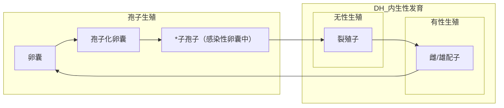
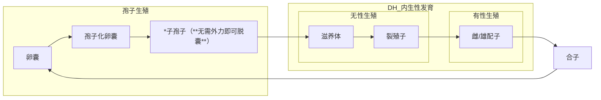
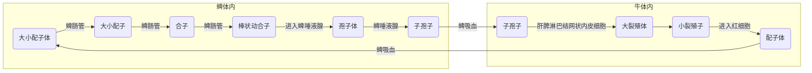

# 概述
## 分类
## 原虫的发现
## 原虫形态结构
## 原虫生殖方式
### 无性生殖
- 二分裂
- 多分裂
- 出芽生殖
### 有性生殖
- 接合生殖
- 配子生殖

# 球虫病
## 鸡球虫病
### 病原及其分类地位
### 病原特征
### IH
### DH 鸡
### 贮藏宿主
### 寄生部位
- 柔嫩艾美尔球虫 盲肠
### 生活史

### 流行病学
- 卵囊对外界环境抵抗力强
### 致病作用
### 病理特征
### 诊断
#### 临床症状
- 柔嫩~ 雏鸡排出大量鲜血便，贫血明显，死亡率可达80%
#### 粪便，肠壁刮取物检查
- 
- 饱和盐水漂浮法
#### 分子生物学检查
### 防治
#### 治疗
- 马杜霉素
- 莫能菌素
- 氯苯胍
- 地克珠利
#### 防控
##### 药物预防
##### 免疫预防

## 鸭球虫病
### 病原及其分类地位
- 毁灭泰泽球虫 泰泽属 致病力强
- 菲莱氏温扬球虫 温扬属
### 病原特征
### IH
### DH 鸭
### 贮藏宿主
### 寄生部位
- 小肠
### 生活史

### 流行病学
- 2-3w最易感 4-6w感染率最高
### 致病作用
### 病理特征
### 诊断
#### 临床症状
- 腹泻，排血红色/暗红色粪便或血液
- 小肠弥漫性出血肠炎
#### 粪检
- 饱和盐水漂浮/直接涂片
#### 分子生物学检查
### 防治
#### 治疗
- 氨丙啉 
- 氯苯胍
- 磺胺类药物
#### 防控
##### 药物预防

## 猪球虫病
### 病原及其分类地位
- 猪等孢球虫 等孢属 致病力强
- 艾美球虫科 艾美耳属
### 病原特征
### IH
### DH 鸭
### 贮藏宿主
### 寄生部位
- 空肠/回肠
### 生活史

### 流行病学
- 成年猪多带虫，为传染源
### 致病作用
### 病理特征
- 肠粘膜异物覆盖，肠上皮细胞坏死并脱落
- 组织边可见长绒毛萎缩&脱落，可见各发育阶段虫体
### 诊断
#### 临床症状
- 排黄色/灰色粪便，恶臭
  - 初粘性
  - 1-2d水样
- 腹泻4-8d，导致仔猪脱水失重，伴感染往往致死
#### 粪检
- 饱和盐水漂浮/直接涂片
#### 分子生物学检查
### 防治
#### 治疗
#### 防控
- 4-5d仔猪预防性用药

## 兔球虫病
### 病原及其分类地位
- 斯氏艾美耳球虫
- 艾美耳属
### 病原特征
### IH
### DH 兔
### 贮藏宿主
### 寄生部位
- 肝 斯氏~
- 肠道 其余
### 生活史

### 流行病学
- <4m幼兔大量死亡
### 致病作用
### 病理特征
### 诊断
#### 临床症状
##### 肠道球虫病
- 腹泻
- 死亡前抽搐/瘫痪
- 回肠/空肠炎症水肿，偶见出血，黏膜溃疡
##### 肝球虫病
- 精神萎靡，烦渴，消瘦，腹部增大
- 肝，胆囊，胆管肿大，肝表面白色结节
### 防治
#### 治疗
#### 防控

# 隐孢子虫病
## 隐孢子虫病
### 病原及其分类地位
- 小鼠隐孢子虫
- **微小隐孢子虫**
- 顶复门 孢子虫纲 球虫亚纲 真球虫目 艾美耳球虫亚目 隐孢科 隐孢子虫属
### 病原特征
- 细胞内寄生
- 成熟卵囊含有4裸露香蕉形子孢子和1残体
### IH
### DH 兔
### 贮藏宿主
### 寄生部位
- 小鼠隐孢子虫 粘膜上皮
- 微小隐孢子虫 小肠黏膜上皮
### 生活史

### 流行病学
- 宿主范围广
- 全球性分布
### 致病作用
### 病理特征
- 空肠绒毛层萎缩损伤
- 肠粘膜固有层的淋巴细胞，浆细胞，嗜酸性粒细胞和巨噬细胞$\uparrow$
- 肠粘膜酶活低，典型肠炎病变 内生发育时期
### 诊断
#### 临床症状
- **严重腹泻**
#### 粪检
- **饱和蔗糖水漂浮法**
#### 间接荧光染色法
### 防治
#### 治疗
- 硝唑尼特 疗效甚微
#### 防控

# 弓形虫病
## 弓形虫病
### 病原及其分类地位
- 刚地弓形虫
- 弓形虫
- 顶复门 球虫纲 肉孢子虫科
### 病原特征
- 机会致病性寄生虫
### IH 多种脊椎动物
### DH 猫科动物
### 贮藏宿主
### 寄生部位
- 小鼠隐孢子虫 粘膜上皮
- 微小隐孢子虫 小肠黏膜上皮
### 生活史 
- 
- 滋养体即假包囊即速殖子
### 流行病学
- 广泛地理流行
### 致病作用
- acute 速殖子/滋养体/假包囊 直接破坏有核细胞
- chronic 缓殖子 包囊体积增大，挤压器官
- 死亡缓殖子 迟发性超敏反应
### 病理特征
- 多实质器官病变
- 肠系膜淋巴结呈绳索状，灰白色
### 诊断
#### 临床症状
##### 人
  - 流产/死胎/畸形儿
  - 免疫功能低下者
    - 脑炎
    - 癫痫
    - 精神异常
    - 死亡
##### 猪
- 仔猪 紫红斑/小点出血
- 流产/死胎/畸形胎
- 失明
- 最后变为僵猪
##### 脏器涂片检查
- 脏器触片
- 集虫法
### 防治
#### 治疗
- 磺胺类与抗菌增效剂合用
#### 防控
- 消灭老鼠

# 鞭毛虫病
## 伊氏锥虫病
### 病原及其分类地位
### 病原特征
- 纺锤形
- 前进运动缓慢
### IH 
### DH 
### 贮藏宿主
- 传播媒介 虻 鳌蝇 虱蝇
### 寄生部位
- 造血器官/血液
### 生活史 
- 纵二分裂法
### 流行病学
### 致病作用
- 免疫病理反应
### 病理特征
- 皮下水肿 
- 胶样浸润
### 诊断
#### 临床症状
- 间隙热
- 耳尾干枯，严重时部分或全部干僵脱落 **焦尾巴症**
##### 脏器涂片检查
- 脏器触片
- 集虫法
### 防治
#### 治疗
- 纳加诺/拜尔205/苏拉灭/萘磺苯酰脲
- 安锥赛/喹嘧胺
- 血虫净/贝尼尔/三氮脒
#### 防控

## 组织滴虫病/黑头病/传染性盲肠肝炎
### 病原及其分类地位
- 火鸡组织滴虫
## 病原特征
### IH 
### DH 火鸡/鸡
### 贮藏宿主/带虫宿主
- 鸡为组织滴虫的带虫宿主
- 蚯蚓为组织滴虫的转续/贮藏宿主
### 寄生部位
- 盲肠&肝
### 生活史 
- 
### 流行病学
- 异刺线虫的虫卵可携带火鸡组织滴虫
  - 典型的超寄生现象
- 火鸡/鸡易感
  - 4-6w鸡最易感
  - 3-12w火鸡最易感
### 致病作用
### 病理特征
### 诊断
#### 临床症状
- 血液循环障碍
  - 鸡冠，肉垂发绀，呈暗黑色
- 盲肠肿胀，内有干酪状肠芯，肝脏圆形坏死灶
#### 实验室检查
- 肝/肾触片
- 姬氏染色
- 镜检
### 防治
#### 治疗
- 甲硝唑
#### 防控
- 定期驱虫（异刺线虫）
- 鸡和火鸡隔离饲养，幼禽和成年禽分开饲养

## 住白细胞虫病/白冠病
### 病原及其分类地位
- 卡氏住白细胞虫
- 沙氏住白细胞虫 
- 真球虫目 疟原虫科
### 病原特征
### IH 
- 传播媒介
  - 卡氏 蚋
  - 沙氏 蠓
### DH 
### 贮藏宿主
### 寄生部位
- 红细胞/白细胞/血管内皮细胞
### 生活史 
- 
### 流行病学
### 致病作用
### 病理特征
### 诊断
#### 临床症状
- 咯血
- 呼吸困难
- 鸡冠/肉垂长白
- 全身性皮下出血
#### 实验室检查
- 翅下/鸡冠静脉采血镜检
- 脏器上灰白色/黄色针尖大小结节镜检
### 防治
#### 治疗
- 磺胺间甲氧嘧啶
- 氯苯胍
#### 防控
- 常规手段
- 免疫预防
  - 病鸡脾脏匀浆

# 血孢子虫病
## 巴贝斯虫病
### 病原及其分类地位
- 双芽巴贝斯虫
- 牛巴贝斯虫
- 顶复门 孢子纲 梨形虫目 巴贝斯科
### 病原特征
### IH 硬蜱
### DH 牛
### 贮藏宿主
### 寄生部位
- RBC
### 生活史 
- 
- 滋养体进入红细胞
- 蜱虫吸感染血后在脾消化道完成配子生殖，动合子移动到脾卵内，在卵内行孢子生殖，子孢子进入幼蜱唾液腺，随叮咬再次感染
### 流行病学
### 致病作用
### 病理特征
### 诊断
#### 临床症状
- 血红蛋白尿
- 贫血，黄疸
### 防治
#### 治疗
#### 防控

# 环形泰勒虫
## 病原及其分类地位
### 病原特征
### IH 
### DH 
### 贮藏宿主
### 寄生部位
### 生活史

### 流行病学
### 致病作用
### 病理特征
### 诊断
#### 临床症状
### 防治
#### 治疗
#### 防控

## 病原及其分类地位
### 病原特征
### IH 
### DH 
### 贮藏宿主
### 寄生部位
### 生活史 
### 流行病学
### 致病作用
### 病理特征
### 诊断
#### 临床症状
### 防治
#### 治疗
#### 防控
