---
markmap:
  colorFreezeLevel: 3
---

# 扁形动物
## 兽医吸虫 trema-toda 学
### features
### 吸虫的发育
#### 宿主
- 第一中间宿主多为螺类
- 第二中间宿主多为🐟蛙螺或insect
#### 发育过程
##### 虫卵 egg
##### 毛蚴 miracidium
##### 胞蚴 sporocyst
##### 雷蚴 redia
##### 尾蚴 cercaria
###### 特点
- 由第一中间宿主逸出
- 活动性好
- 钻入第二中间宿主/终末宿主
##### 囊蚴 metacercaria
###### 生活史
- 自由生活
- 水生 aquatic 第二宿主 second IH 在组织内形成囊蚴，此时具有感染性
    - 华支睾吸虫 Clonorchis
    - 板体吸虫 Platynosomum
- 陆生 terrestria 第二宿主 被蚂蚁摄入后发育为囊蚴
    - 矛形双腔吸虫 Dicrocoelium 操纵寄主
##### 成虫 adult
### 分类 扁形动物门 Platyhelminthes 吸虫纲 Trematoda
#### 单殖目 mono-genea
##### 寄生于鱼类/两栖类表皮 单宿主
#### 复殖目 di-genea
##### 寄生于人/家畜，更换宿主
##### 腹口亚目
##### 前口亚目
###### 单盘类 mono-stomes 只有一个吸盘，寄生于爬行类和鸟类
###### 对盘类 amphi-stomes 腹吸盘位于虫体后端，又称后吸盘
###### 全盘类 hola-stomes 体分前后两部，前体有口&腹两吸盘，多寄生于鸟类肠道
###### 分体类 schistosomes 体细长，雌雄异体
###### 棘口类 echino-stomes 有头冠和头棘，口腹吸盘相距近
###### 双盘类 di-stomes 口吸盘环绕口孔，腹吸盘位于腹面，但不在虫体的末端或近末端
- 片形科
    - 片形属
    - 姜片属
- 后睾科
    - 支睾属
    - 微口属
    - 后睾属
- 双腔科
    - 双腔属
    - 阔盘属
    - 平体属
- 前殖科
    - 前殖属
    - 斜睾属
- 短咽科
    - 斯孔属
#### 盾腹目 aspidogastrea 
##### 寄生于软体动物/脊椎动物 1/2宿主
### 吸虫病
#### 反刍动物吸虫病 fluke disease in ruminants
#####
| 病名 | 病原 | 病原分类地位 | 寄生部位 | 中间宿主 | 主要症状 |
|-|-|-|-|-|-|
| 肝片吸虫病 | 肝片吸虫 | 复殖目-前口亚目-双盘类-片形科-片形目 | 肝脏胆管 | 锥实螺 | acute:肝炎 死亡 <br/> chronic: 消瘦 贫血 水肿 | 
| 前后盘吸虫病 | 🦌前后盘吸虫等 | 复殖目-前口亚目-对盘类-前后盘科/同腔科 | 童虫：多种脏器<br/>成虫：瘤胃 | 扁卷螺 | 童虫:严重腹泻 贫血 <br/> 成虫: 消化不良 | 
| 双腔吸虫病 | 牙形双腔吸虫 | 复殖目-前口亚目-双盘类-双腔科-双腔属 | 肝脏胆管 | 陆地螺 蚂蚁 | 消瘦 黄疸 水肿 类似慢性肝片吸虫病 |
##### 片形吸虫病
###### IH 锥实螺科的淡水螺
###### DH 反刍动物 人
######
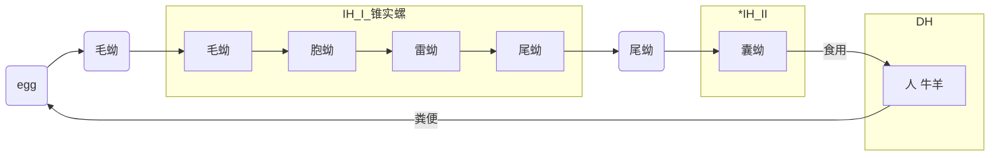
###### 病原形态
###### 致病作用 pathogenesis
- 肝肿大，包膜下有小出血斑，表面有圆形小孔及线状虫道
- 胆管扩张，增厚，变粗甚至堵塞，胆汁停滞
- chronic病例肝脏无特殊变化，切开时有沙沙声，可见胆管扩张增厚变粗，并有盐类沉积和虫体
- 病程
    - 急性期
        - 由童虫juvenile flukes引起
        - 在🐏中常见
        - 穿过肠壁来到腹腔(in 24h after infect),穿透肝脏包膜进入肝脏组织，在肝实质中迁移导致组织的破坏和出血
        - 并发症：组织坏死导致感染，引发急性毒血症（黑病），继发传染性坏死性肝炎
    - 慢性期 
        - 由成虫引起 
        - 在🐂中常见
        - 成虫寄生在胆管内，引起胆管上皮的纤维化，肥厚和增生；由于寄生虫的长期存在导致钙化/胆结石
        - 在🐏中不存在自然的保护性免疫
###### 诊断 diagnosis
- 临床症状
  - 可视粘膜苍白 pale mucous 腹泻 diarrheoa
  - 下颌水肿 bottle jaw
- 尸检 post-mortem
- 粪便虫卵检测 feacal egg counts
  - thin shelled 薄壳 large tan 棕褐色 operculate 有盖的
  - 使用沉降法 sedimentati 虫卵密度较大
- 血清学 sero-logy
  - igG ELISA
    - 4-6 w sheep
    - 6-8 cattle
- biochem
  - anaemia 贫血
  - elevated liver enzymes 肝损伤导致的肝脏转氨酶上升
  - hypo-protein-emia 高蛋白血症
###### 防治
- 预防 prevention
  - 远离淡水螺活跃区域放牧，避免牧场积水
  - 疫苗免疫
  - 不建议使用灭螺剂mollu-scide
- 治疗 treatment
  - 噻苯达唑 tricalbendazole 阿苯达做 albendazole 氯羟柳胺 oxyclozanide 伊维菌素
  - 春秋两季驱虫
##### 前后盘吸虫病
###### IH 锥实螺/扁卷螺
###### DH 反刍动物（🐂🐏🐫🦌）童虫十二指肠3-8w->成虫网胃reticulum&瘤胃rumen
######
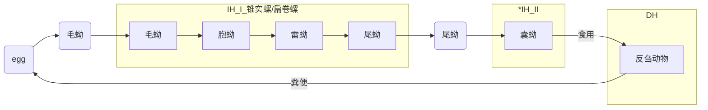
###### 病原形态
- 梨形，橙色，0.5-1cm长，口吸盘位于虫体前端，腹吸盘位于虫体亚末端
###### 致病作用 pathogenesis
- 童虫在十二指肠中引发溃疡ulceration，出血haemorrhage，肠炎enteritis
###### 诊断 diagnosis
- 临床症状
  - 顽固性腹泻
  - 粪便粥样/水样，常有腥臭味（出血性肠炎）
- 尸检 post-mortem 
- 粪便虫卵检测 feacal egg counts
  - thin shelled 薄壳 large tan 棕褐色 operculate 有盖的
  - 使用沉降法 sedimentati 虫卵密度较大
###### 防治
##### 胰阔盘吸虫病
###### IH 
- first IH 阔纹蜗牛 中华蜗牛
- second IH 草螽
###### DH 牛羊胰脏胰管
######
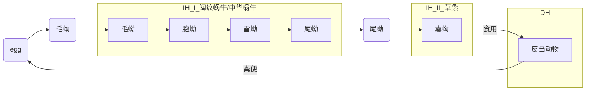
###### 病原形态
###### 致病作用 pathogenesis
###### 诊断 diagnosis
- 临床症状
  - 胰腺炎，胰腺功能下降
  - 营养不良，贫血，消瘦，面部水肿，泡沫样流水
  - 下痢，严重时引起死亡
  - 人体感染 营养不良，消瘦，贫血，水肿，腹泻，可能引发急性胰腺炎导致死亡
###### 防治
##### 双腔吸虫病
###### IH 
- first IH 条纹蜗牛（西北）/蚶小丽螺（东北）
- second IH 蚂蚁
###### DH 反刍动物（🐂🐏🦌🐫）肝脏胆管胆囊
######
```mermaid
    graph LR
    1(egg)-->2(毛蚴)
    2-->3[毛蚴]
    subgraph IH_I_条纹蜗牛（西北）/蚶小丽螺（东北） 
        3-->4[胞蚴]
        4-->5[雷蚴]
        5-->6[尾蚴]
    end
    6-->7(尾蚴)
    7-->8[囊蚴]
    subgraph IH_II_蚂蚁
        8
    end
    subgraph DH
        8-->|食用|9[反刍动物]
    end
    9-->|粪便|1
```
###### 病原形态（矛形双腔吸虫）
- 小，修长，柳叶状，~0.5cm
- 生殖孔位ventral sucker于腹吸盘ventral sucker前方，盲肠caeca不分支 
###### 致病作用 pathogenesis
###### 诊断 diagnosis
- 临床症状
  - 胰腺炎，胰腺功能下降
  - 营养不良，贫血，消瘦，面部水肿，泡沫样流水
  - 下痢，严重时引起死亡
  - 人体感染 营养不良，消瘦，贫血，水肿，腹泻，可能引发急性胰腺炎导致死亡
###### 防治
##### 斯克里亚宾吸虫病
###### IH 
- first IH 陆地螺
- second IH 同一螺/同科其他螺
###### DH 胆管，小肠
######
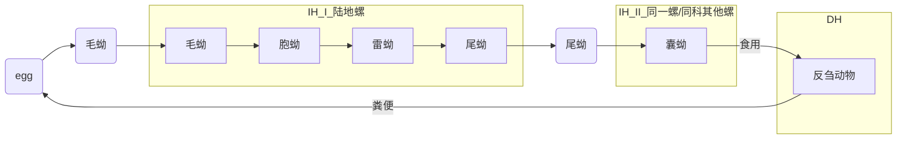
###### 病原形态 
###### 致病作用 pathogenesis
###### 诊断 diagnosis
- 临床症状
  - 肠炎，腹泻，贫血，消瘦
###### 防治
##### 血吸虫病
###### IH 
- first IH 钉螺
###### DH 人畜共患
- 寄生于肠系膜静脉&门静脉
  - 曼氏血吸虫
  - 日本血吸虫
  - 湄公河血吸虫
  - 间插血吸虫
- 寄生于膀胱静脉
  - 埃及血吸虫
######
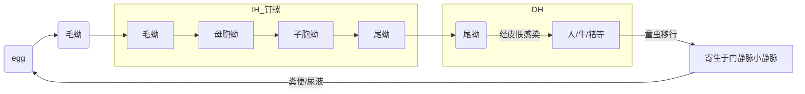
###### 病原形态
- 雄虫 10-18mm，粗短，虫体向中线卷曲形成抱雌沟
- 雌虫 13-20mm，细长，位于抱雌沟内，呈雌雄合抱状态
- 如不合抱，两者将都不能发育为成虫，只保留童虫状态

###### 流行病学 epidemiology
- 曼氏血吸虫 非洲，中东，加勒比，南美
- 日本血吸虫 中国，印度尼西亚，菲律宾
- 埃及血吸虫 非洲和中东 膀胱癌的主要诱因，与艾滋病传播相关

###### 致病作用 pathogenesis
- supurior acute 接触疫水6-8h，可见尾蚴性皮炎
- acute 发烧，寒战，咳嗽，肌肉酸痛，头痛，腹痛 abdominal pain
- chronic 炎症
  - 童虫移行
  - 门管区虫卵钙化，淋巴细胞浸润，纤维组织增生
  - 门管区可见虫卵沉积

###### 诊断 diagnosis
- 粪便学检查 金标准
- 毛蚴孵化
- 血清学检查
- 剖检 post-mortem

###### 防治
- 治疗 treatment
  - 吡喹酮 (Praziquantel) 为首选药物
- 预防 prevention
  - 大规模给药mass drug administration（MDA）
  - 灭螺 using mollu-suicides/environmental modifications
  - 粪便管理及水源保护
  - 避免接触疫水

#### 猪吸虫病
#####
| 病名 | 病原 | 病原分类地位 | 寄生部位 | 中间宿主 | 主要症状 | 感染途径 |
|-|-|-|-|-|-|
| 姜片吸虫病 | 布氏姜片吸虫 |  | 小肠 |  | 最重要，肠炎，消瘦，贫血 | 生食水生植物 |
| 肝片形吸虫 | 肝片形吸虫 |  | 肝胆管 | | 肝炎，肝硬化，消瘦 | 采食水草/饮疫水 |
| 后睾吸虫病 | 猫后睾吸虫 |  | 肝脏胆管 |  | 肝胆病变，公共卫生学重要 | 生食淡水鱼 |
| 拟腹盘吸虫病 | 人拟腹盘吸虫 |  | 盲肠结肠 |  | 肠炎，腹泻 | 生食水生植物 | 
| 棘口吸虫 | 棘口吸虫 |  | 肝胆管 | | 肠炎（通常较轻） | 生食螺，蝌蚪 |
##### 姜片吸虫病
###### IH 
- 扁卷螺
###### DH Pigs & humans 人和猪
- 寄生于小肠 (primarily the duodenum – jejunum)
###### 
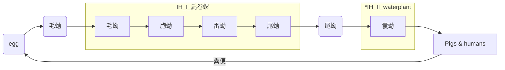
###### 病原形态
- 成虫：
  - 2 to 7.5 cm in length and 1 to 2 cm in width
  - 外形：背腹扁平，前窄后宽，呈长卵圆形，肥厚，像一个斜切的姜片
  - 吸盘：腹吸盘比口吸盘大4～5倍；口吸盘亚顶位，腹吸盘在近口吸盘下方，呈漏斗状
  - 消化系统：肠支在腹吸盘前分叉，呈波浪状弯曲，延至末端
  - 雌雄同体：卵巢呈树枝状，位于虫体中部；睾丸呈珊瑚状
- 虫卵：
  - 长0.137-0.153 mm，宽0.071-0.084 mm
  - 淡黄色，椭圆形，有卵盖，多个卵黄细胞和一个胚细胞
  - 卵壳薄而均匀，一端有一不明显的小卵盖

###### 致病作用 pathogenesis
- 最重要，肠炎、消瘦、贫血

###### 诊断 diagnosis
- 粪便学检查
  - Thin shelled, large, tan, operculate
  - Sedimentation technique (eggs heavy)
- 血清学检查
  - Blood tests that detect antibodies or antigens
- 剖检
  - Post-mortem examination

###### 防治
- 治疗、防治：参照肝片形吸虫病内容

#### 禽poultry吸虫病
#####
| 病名 | 病原 | 病原分类地位 | 寄生部位 | 中间宿主 | 主要症状 | 感染途径 |
|-|-|-|-|-|-|
| 肝胆管吸虫病 | 肝片吸虫等 |  | 肝胆管 |  | 消瘦，贫血，肝肿大 | 生食含囊蚴水草/螺 |
| 输卵管吸虫 | 前殖吸虫 |  | 输卵管 | | 产软壳蛋，无壳蛋，腹膜炎 | 生食含囊蚴蜻蜓 |
| 肠道吸虫病 | 棘口吸虫等 |  | 肠道 |  | 腹泻，消瘦，肠炎 | 生食含囊蚴水生生物 |
| 血液吸虫病 | 毛毕吸虫 |  | 血管（门静脉） |  | 贫血，腹泻，便血 | 尾蚴穿透皮肤 | 
##### 前殖吸虫病
###### IH
- first IH 淡水螺
- second IH 蜻蜓幼虫（水虿）
###### DH
- 家禽，野鸟的输卵管（子宫部），直肠，泄殖腔，法氏囊
###### 生活史
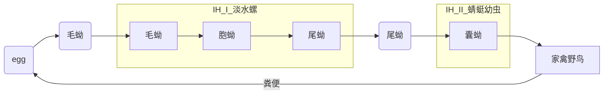
###### 致病作用
- 输卵管病变：输卵管炎症，扩张甚至撕裂，甚至导致死亡
- 输卵管炎和泄殖腔炎，黏膜增厚，充血和出血，黏液增多
- 输卵管子宫部黏膜布满芝麻粒大小的灰白色颗粒和出血斑点，在白色颗粒和出血点处可挑出虫体
###### 诊断
- 临床表现
  - 初期：产软壳蛋，薄壳蛋，畸形蛋
  - 中期：抱窝 false broodiness
  - 后期：从泄殖腔流出石灰样或卵黄样物质，重病可致死
###### 防治
- 加强饲养管理：装纱窗，防止媒介飞入
- 鸡舍定期清理、消毒
- 预防性驱虫
  - 根据发病季节（尤其梅雨季）在鸡群95 115 135日龄进行三次预防性驱虫，之后每月一次，及早消除隐患，直至产蛋高峰出现
- 产蛋鸡驱虫需注意休药问题！
##### 棘口吸虫病
###### IH 
- 淡水螺
- 水螺/蛙/淡水鱼
###### DH 家禽直肠&盲肠，成虫附着小肠黏膜
###### 生活史
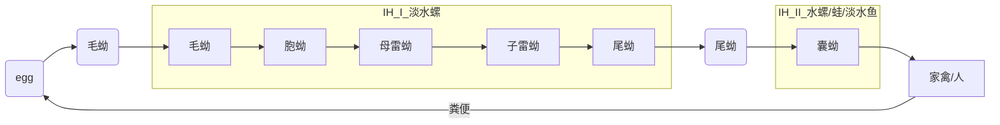
###### 流行病学
- 动物 世界流行
- 人 东亚/东南亚
###### 致病作用
- 虫体吸盘、头棘和体棘刺激、破坏肠粘膜
###### 诊断
- 临床症状
  - 肠道出血
  - 肠炎
  - 下痢
##### 背孔吸虫病
###### IH 淡水螺
###### 病原形态
- 虫卵 小，两端各有一根卵丝
- 成虫 虫体淡红色，无腹吸盘，腹面（看似位于背部）有三行腹腺

## 兽医绦虫病 
### feature
- 背腹扁平，不透明，带状，雌雄同体
- 颜色：白色或乳白色
- 大小：数毫米至数米不等
- 虫体
  - 头节
  - 颈节（生长节）
  - 体节
    - 未成熟节片（幼节）
    - 成熟节片（成节）
    - 孕卵节片（孕节）
- 内部结构
  - 体壁 皮层和皮下肌层，吸收营养物质，运动
  - 实质，无体腔
  - 生殖器官 雌雄同体，有1/2组生殖器官
  - 神经系统在头节
  - 排泄系统
  - 无消化循环呼吸系统
### 发育
- 受精方式 大多自体节受精，也有异体受精
- 寄生在畜禽体内的绦虫均需要中间宿主参与才能完成生活史
- 生活史
  - 虫卵
    - 结构 由内到外
      - 六钩蚴
      - 胚膜
      - 胚层
      - 卵壳 薄，易脱落
  - 中绦期
    - 节肢动物 似囊尾蚴
    - 哺乳动物 囊尾蚴
      - 单囊尾蚴
      - 多头蚴 囊壁上有多个头节
      - 棘球蚴 囊内除头节外还有无数生发囊/子囊，每个生发囊/子囊由产生许多头节（原头蚴）
      - 链尾蚴 头节在体的前端，末端为一个囊泡，头节与囊泡之间有较长的链体，链体分节，但无性器官
  - 成虫
    <table border="1">
      <thead>
        <tr align="center">
          <td></td>
          <td>头节</td>
          <td>体节</td>
          <td>生殖系统</td>
          <td>卵</td>
        </tr>
        <tr align="center">
          <td rowspan="2">假叶目</td>
          <td rowspan="2">双槽型</td>
          <td rowspan="2">节片间界限不清或没有</td>
          <td rowspan>生殖孔在体节中部</td>
          <td rowspan="2">有盖</td>
        </tr>
        <tr>
          <td>排卵</td>
        </tr>
        <tr align="center">
          <td rowspan="2">圆叶目</td>
          <td rowspan="2">四个吸盘</td>
          <td rowspan="2">节片间界限明显</td>
          <td rowspan>生殖孔在体节侧缘</td>
          <td rowspan="2">无盖</td>
        </tr>
        <tr>
          <td>不排卵有孕节</td>
        </tr>
      </thead>
    <table>
### 囊尾蚴病
#### 猪囊尾蚴病cysticercosis/囊虫病
##### 病原及其分类地位
- 链状带绦虫（猪带绦虫）
- 圆叶目 带科
##### IH 猪/野猪/人
##### 寄生部位
- 成虫 人的小肠
- 幼虫（猪囊尾蚴） 猪的肌肉，偏好活动性大的肌肉，ex. 嚼肌 心肌 肋间肌
##### 病原形态
- 虫卵 圆球形，内有一较厚的胚膜，呈放射条纹状，胚膜内有囊液和球形的六钩蚴
- 幼虫（囊尾蚴） 米粒大，白色半透明囊状物，囊内充满囊液和内翻头节，其形态结构与成虫类似
- 成虫 
  - 头节 4吸盘 顶端具能伸缩的顶突，顶突上有内外两圈小钩
  - 孕节 充满虫卵的子宫向两侧发出分支
##### 流行病学
- 南美
- 非洲
- 中国
##### 生活史
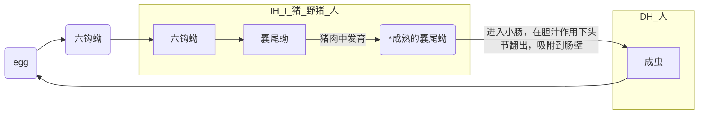
##### 诊断
###### 临床症状
- 猪
  - 腮部肌肉发达，前膀宽，胸部肌肉发达，后躯较狭窄--雄狮状
  - 肌肉中含有囊尾蚴--米猪肉
  - 咬肌和肩胛肌皮肤常表现有节奏性的颤动，打呼噜（深夜或清晨明显）
- 人
  - 脑囊尾蚴病 seizure 脑膜炎
  - 眼囊尾蚴病 眼球肿大
  - 皮下与肌肉囊尾蚴病 皮下组织出现大量结节
- 初期肌肉发生疼痛，跛行但不久即消失
- 雄狮状 打鼾 肌肉震颤 触诊舌系部豆状肿胀
- 生前检查眼睑和舌部豆状结节
- 宰后检验确认 嚼肌，腰肌，心肌，骨骼肌是否有乳白色椭圆形/圆形包囊，包囊内有半透明液体，囊壁上有一白色结节

#### 牛囊尾蚴病
##### 病原及其分类地位
- 牛带绦虫
- 圆叶目 带科
##### IH 牛，羊，美洲驼，长颈鹿，羚羊
##### 寄生部位
- 人（成虫） 小肠
- 牛（囊尾蚴） 咀嚼肌，舌肌，心肌，腿肌
##### 病原形态
- 虫卵 与猪带绦虫/链状带绦虫虫卵极相似
- 囊尾蚴 略小于猪囊尾蚴，头节与成虫相似，无顶突和小钩
- 成虫 乳白色，背腹扁平，长如带状，分节，体节分未成熟，成熟和妊娠三种节片
- 猪带绦虫孕节子宫分支不整齐，每侧约7-13支；牛带绦虫孕节子宫分支整齐，每侧约15-30支，支端多有分叉
##### 流行病学
##### 生活史
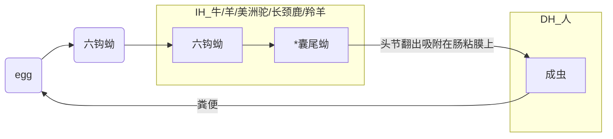
##### 诊断
###### 临床症状
- 剖检可见牛心肌，咬肌，舌肌等肌肉处发现牛囊尾蚴

#### 多头蚴病/脑包虫病/旋回病/羊疯病
##### 病原及其分类地位
- 多头绦虫
- 圆叶目 带科 
##### IH 反刍动物/人
##### DH 犬科动物
##### 寄生部位
- 绵羊，山羊的脑脊髓内
##### feature
- 脑多头蚴
  - 乳白色，半透明囊泡，呈圆形/卵圆形，豌豆大到鸡蛋大，囊壁上有集成簇的许多原头蚴，囊内充满液体
  - 囊壁由两层膜组成，外膜为角质膜，内膜为生发层，其上由几个到几百个不均匀的原头蚴（头节）
- 脑多头绦虫
  - 呈扁平带状，虫体长40-100cm，有200-250个节片
  - 头节上有4个吸盘，顶突上有两圈角质小钩（22-32个小钩）
  - 成节呈方形，孕节子宫内充满虫卵，子宫侧枝有14-26对。虫卵直径为29-37um，内含六钩蚴
##### 生活史
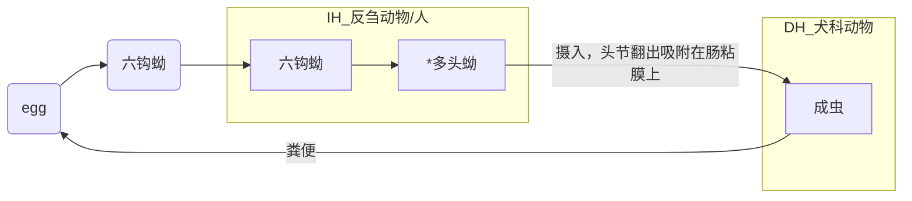
##### 诊断
- 临床症状
  - acute 
    - 体温升高
    - 脉搏加快
    - 呼吸次数增多
    - 出现神经症状，似有兴奋表现
  - chronic
    - 脑炎
    - 脑膜炎
    - 典型症状随虫体寄生部位，出现不同特征的转圈方向和姿势
      - 寄生在大脑表面 转圈运动

#### 棘球蚴病/包虫病
##### 病原及其分类地位
- 棘球绦虫 圆叶目 带科
  - 人畜共患
    - 细粒棘球绦虫
    - 泡状/多房棘球绦虫
##### IH 食草动物/人
##### DH 食肉动物
##### 寄生部位
- 人/食草动物 肝脏/肺/脑等实质器官 -> 形成包囊
- 食肉动物 小肠黏膜/小肠肠壁隐窝
##### feature
##### 生活史
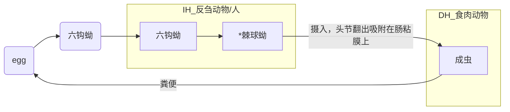
##### 流行病学
###### 临床症状
- 病程长，晚期肝包虫病患者极度消瘦/腹胀如鼓
- 脑包虫病患者 seizure反复发作
- 囊型包虫病病灶破裂 过敏性休克乃至死亡
- 泡型包虫病/“虫癌”
  - 类肝癌样浸润生长
  - 晚期出现黄疸，门脉高压，肝腹水等症状
###### 防治
- 治疗
  - 首选手术治疗
    - 肝包虫内囊摘除术
    - 包虫完整摘除术
    - 肝叶切除术
    - 经脾穿刺包虫吸刮术
    - 病变范围广 肝移植
- 防控
  - 不要将内脏和生肉喂给狗
  - 预防性给药--犬每6周给吡喹酮
  - 屠宰场剖检监测病原
  - 疫苗
  - 不吃生食，不喝生水
  - 加强犬只管理，定期驱虫，及时驱离无主犬，防止犬粪污染草场，饲料，水源
  - 预防牛羊感染，加强屠宰管理，病死的羊应当深埋/焚烧
  - 如有牧区旅行史且有相关症状，需要及时就医
#### 细颈囊尾蚴病
##### 病原及其分类地位
- 带状绦虫 圆叶目 带科
##### IH 猪/黄牛/绵羊/山羊等多种家畜及野生动物
##### DH 犬/狼等食肉兽
##### 寄生部位
- IH 肝脏浆膜，网膜，肠系膜，严重时进入胸腔，寄生于肺部
- DH 小肠
##### feature
- 细颈囊尾蚴 俗称水铃铛，呈囊泡状，黄豆大/鸡蛋大，囊壁乳白色，囊内含透明液体和一个头节
##### 诊断
###### 病理变化
- 肝脏，肠系膜，网膜等处发现细颈囊尾蚴
- 肝脏体积增大，表面粗糙并有散在出血点，肝实质中有虫体移行的孔道
- 可见腹膜炎，腹水等病变
### 牛羊绦虫病
#### 牛羊莫尼茨绦虫病
##### 病原及其分类地位
- 莫尼茨绦虫 圆叶目 裸头科 莫尼茨属
  - 扩展莫尼茨绦虫
  - 贝氏莫尼茨绦虫
##### IH 地螨
##### DH
- 羔羊 扩展莫尼茨绦虫
- 犊牛 贝氏莫尼茨绦虫
##### 寄生部位
- 牛羊 小肠
##### feature
- 扩展莫尼茨绦虫
  - 虫卵 三角形/圆形，内含有六钩蚴的梨形器
- 贝氏莫尼茨绦虫
  - 虫卵 方形/六边形，内含有六钩蚴的梨形器
##### 致病作用
- 机械作用：莫尼茨绦虫为大型虫体，长达数米，宽1-2cm，大量寄生时，积聚成团，造成肠腔狭窄，甚至发生肠阻塞，套叠或扭转，最后因肠破裂引起腹膜炎而死亡
- 夺取营养：虫体在肠道内生长很快，每昼夜可生长8cm，需从宿主体内夺取大量养料，影响幼畜的生长发育，使之迅速消瘦，体质衰弱
- 中毒作用：虫体的代谢产物和分泌的毒性物质被宿主吸收后，可引起各组织器官发生炎症和退行性病变。中毒作用还破坏神经系统和心脏及其他器官的活动
##### 生活史
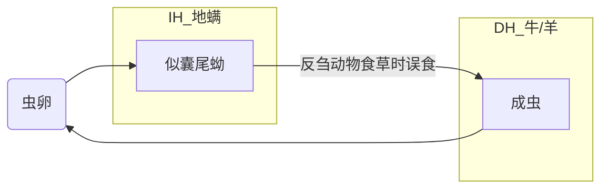
##### 防治
###### 治疗
- 吡喹酮
- 苯并咪唑
###### 防控
- 粪便faecal检测
- 尸检necro-psy
- 策略性驱虫
- 牧场pasture管理
- 螨虫控制

#### 曲子宫绦虫病
##### 病原及其分类地位
- 盖氏曲子宫绦虫 圆叶目 裸头科
##### IH
##### DH
##### 寄生部位
##### feature
- 成虫
  - 一套生殖器官，子宫管状横行
- 虫卵
  - 椭圆形，有六钩蚴，无梨形器，虫卵包在一个副子宫器内
##### 生活史
##### 流行病学
##### 致病作用
##### 诊断
##### 防治
###### 治疗
###### 防控


#### 无卵黄腺绦虫病
##### 病原及其分类地位
- 中点无卵黄腺绦虫 圆叶目 裸头科
##### IH 地螨
##### DH 牛羊
##### 寄生部位
##### feature
- 成虫
  - 虫体长而窄
  - 头节上有四个吸盘，无顶突和小钩
  - 节片极短，分节不明显
  - 每个成熟节片内含有一组生殖器官，生殖孔左右不规则地交替排列在节片的边缘
    - 睾丸位于两侧纵排泄管的内外侧
    - 卵巢呈圆球形，位于生殖孔和子宫之间
    - 子宫在节片中央
    - 无卵黄腺和梅氏腺
- 虫卵
  - 椭圆形，有六钩蚴，无梨形器，虫卵包在一个副子宫器内
##### 生活史
##### 流行病学
- 分布在高寒，干燥地区
##### 致病作用
##### 诊断
##### 防治
###### 治疗
###### 防控

### 禽类绦虫病
#### 赖利绦虫病/鸡绦虫病
##### 病原及其分类地位
- 四角赖利绦虫
- 棘沟赖利绦虫
- 有轮赖利绦虫
- 圆叶目 戴文科 赖利属
##### IH
##### DH
##### 寄生部位
##### feature
- 成虫
  - 一套生殖器官，子宫管状横行
- 虫卵
  - 椭圆形，有六钩蚴，无梨形器，虫卵包在一个副子宫器内
##### 生活史
##### 流行病学
- 感染途径 经消化道感染，禽类啄食含有病原的中间宿主而感染
- 虫卵在中间宿主体内发育为似囊尾蚴，含似囊尾蚴的中间宿主被鸡啄食后，在鸡体内约经20d发育为成虫
- 放养的雏禽易感染，各种年龄的鸡均可感染，但17-40日鸡易感性强，死亡率高
##### 致病作用
##### 诊断
###### 临床症状
- 大量感染时虫体积聚成团，导致肠梗阻，甚至肠破裂而引起腹膜炎；代谢产物被吸收后可引起中毒反应，出现神经症状
- 鸡粪便稀且有黏液，食欲降低，渴饮增加，迅速消瘦，精神沉郁，两翅下垂，头颈扭曲，蛋鸡产蛋量明显下降或停产，最后极度衰竭而死亡
- 剖检可见肠黏膜增厚，出血，肠腔内有大量黏液，恶臭
##### 防治
###### 治疗
###### 防控

#### 节片戴文绦虫病
##### 病原及其分类地位
- 节片戴文绦虫 圆叶目 戴文科 戴文属
##### IH 陆地蜗牛/蛞蝓
##### DH 小肠
##### 寄生部位
##### feature
- 成虫
  - 鸡十二指肠
##### 生活史
##### 流行病学
##### 致病作用
##### 诊断
###### 临床症状
- 头节深入肠壁，引起急性炎症
- 腹泻，粪中含黏液或带血，精神萎顿，行动迟缓，高度衰弱与消瘦，有时从两腿开始麻痹，逐渐发展波及全身以致死亡
- 剖检：肠黏膜增厚，出血，肠腔内含有大量黏液，恶臭
##### 防治
###### 治疗
###### 防控

#### 节片戴文绦虫病
##### 病原及其分类地位
- 节片戴文绦虫 圆叶目 戴文科 戴文属
##### IH 陆地蜗牛/蛞蝓
##### DH 小肠
##### 寄生部位
##### feature
- 成虫
  - 鸡十二指肠
##### 生活史
##### 流行病学
##### 致病作用
##### 诊断
###### 临床症状
- 头节深入肠壁，引起急性炎症
- 腹泻，粪中含黏液或带血，精神萎顿，行动迟缓，高度衰弱与消瘦，有时从两腿开始麻痹，逐渐发展波及全身以致死亡
- 剖检：肠黏膜增厚，出血，肠腔内含有大量黏液，恶臭
##### 防治
###### 治疗
###### 防控

#### 矛形剑带绦虫病
##### 病原及其分类地位
- 矛形剑带绦虫 圆叶目 膜壳科 剑带属
##### IH 剑水蚤
##### DH 鹅
##### 寄生部位
- 鹅的十二指肠和空肠
##### feature
- 成虫
  - 鸡十二指肠
##### 生活史
##### 流行病学
- 有明显季节性，多发于4-10月份，而在冬季和早春较少发生
##### 致病作用
##### 诊断
###### 临床症状
- 消化机能障碍 排出白色稀薄的粪便（内含节片）
- 神经症状
- 十二指肠/空肠内发现大量绦虫，严重者甚至堵塞肠道
##### 防治
###### 治疗
###### 防控

### 犬猫绦虫病
#### 犬绦虫病
##### 病原及其分类地位
- 犬复孔绦虫 圆叶目 囊宫科 复殖孔属
##### IH 跳蚤
- 犬栉首蚤
- 猫栉首蚤
- 致痒蚤
##### DH 犬猫
##### feature
- 成虫
  - 储卵囊 椭圆形，每个储卵囊内含1-30个虫卵，数量不等
- 虫卵 圆球形，直径25-40um，双层卵壳，内含六钩蚴，储卵囊破裂时，可以看到单独存在的虫卵
##### 生活史
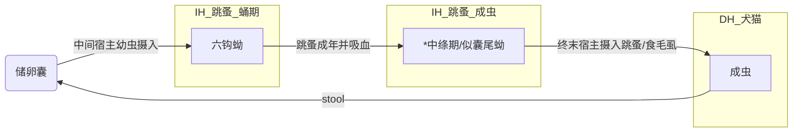
##### 流行病学
##### 致病作用
##### 诊断
###### 临床症状
- 全身症状
  - 成虫可导致维生素，矿物质微量元素和碳水化合物的中度流失，因此可以在饲喂不足或严重感染的动物或生长中的幼龄食肉动物中看见消瘦症状
  - 局部症状 食欲不定，有时甚至增加软便/腹泻性粪便（attribute to 充血性肠炎）孕节片排出
  - 瘙痒 肛周区域瘙痒，最典型的是在地面上摩擦/拖动后端。舔肛周部位还会导致虫卵堆积在动物的皮毛上
  - 粪检：肛周及粪便中的绦虫孕节，长度约3-5mm，形似煮熟后的白色饭粒，具有运动性
##### 防治
###### 治疗
- 吡喹酮 5mg/kg
- 吡喹酮+硫酸镁+甘露醇
###### 防控
- 控制跳蚤
- 饲养宠物的家庭应避免幼儿直接接触宠物，如接触后应立即洗手
- 日常注意个人卫生与饮食卫生；定期对家中宠物猫、犬进行驱虫和灭蚤

#### 迭宫绦虫病
##### 病原及其分类地位
- 曼森氏迭宫绦虫
- 刺猬迭宫绦虫
- 曼氏迭宫绦虫
- 假叶目 双叶槽科 迭宫属
##### IH 
- first IH 剑水蚤
- second IH 蛙/人
##### 贮藏宿主RH 人/蛇/鸟类/猪等多种脊椎动物
##### DH 犬猫和一些野生食肉动物（狮 虎 貂 狐 狼 浣熊）/人
##### 寄生部位
- 成虫 寄生于动物小肠，可引起动物腹泻，呕吐，体重减轻等消化道症状
- 裂头蚴 寄生于人体多种部位，分别引起眼，皮下，口腔，颌面部，脑和内脏裂头蚴病，危害严重
##### feature
- 虫卵 透明/淡黄色，椭圆形，卵壳较薄，两端稍尖，一侧有卵盖，两侧不对称
- 成虫 指状，背腹面各有一条纵行吸槽
- 裂头蚴 长带形，白色，头端膨大，中央有一明显凹陷，与成虫头节相似，体不分节但具不规则横这周，后端多呈钝圆形，活动时伸缩能力很强
##### 生活史
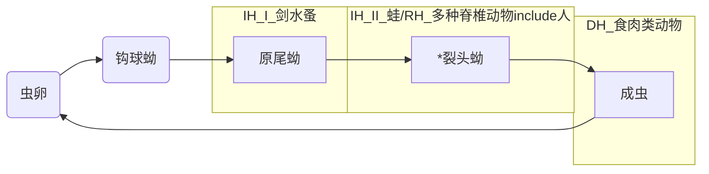
##### 流行病学
- 感染方式
  - 局部敷贴生蛙肉
  - 吞食生的/未煮熟的蛙蛇鸡或猪肉
  - 误食感染的剑水蚤
##### 致病作用
##### 诊断
###### 临床症状
- 人裂头蚴病
  - 眼裂头蚴病
  - 皮下裂头蚴病
  - 脑裂头蚴病
  - 内脏裂头蚴病
  - 口腔颌面部裂头蚴病
##### 防治
###### 治疗
- 成虫感染 吡喹酮，阿苯达唑
- 裂头蚴主要靠手术摘除，术中注意务必将虫体尤其是头部取尽，方能根治；也可用40%酒精普鲁卡因2-4ml局部注射杀虫
- 增殖裂头蚴病治疗困难，多保守治疗
###### 防控
- 加强健康教育
  - 不用蛙肉敷贴
  - 不食用生的/未煮熟的肉类
  - 不饮生水

#### 阔节裂头绦虫病
##### 病原及其分类地位
- 阔节裂头绦虫/鱼绦虫 假叶目 裂头科 裂头属
##### IH 
- first IH 剑水蚤
- second IH 鱼类
##### DH 人/猫/狗 
##### 寄生部位
- 成虫 寄生于动物肠道
##### feature
- 虫卵 近卵圆形，壳厚，一段有明显卵盖 
- 成虫 最长可达10m，节片宽可达20mm，头部细小，无头钩，为裂隙状
- 裂头蚴 长带形，白色，头端膨大，中央有一明显凹陷，与成虫头节相似，体不分节但具不规则横这周，后端多呈钝圆形，活动时伸缩能力很强
##### 生活史
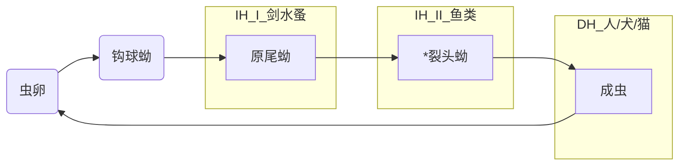
##### 流行病学
- 波罗的海
- 俄罗斯
- 斯堪的纳维亚
- 北美
- 南美
- 亚洲-日本（sushi&sashimi）
##### 致病作用
##### 诊断
###### 临床症状
- 感染者通常没有症状
- 可能会出现腹泻，腹痛，贫血，体重减轻
- 维生素B12缺乏
##### 防治
###### 治疗
- 成虫感染 吡喹酮，阿苯达唑
- 裂头蚴主要靠手术摘除，术中注意务必将虫体尤其是头部取尽，方能根治；也可用40%酒精普鲁卡因2-4ml局部注射杀虫
- 增殖裂头蚴病治疗困难，多保守治疗
###### 防控
- 不喝生水，不吃鱼生，不吃没煮熟的食物
- 加强对家里的犬猫等动物的管理，避免其粪便污染河流水库


<table border="1">
  <thead>
    <tr align="center">
      <td rowspan="2">所属疾病大类</td>
      <td rowspan="2">疾病</td>
      <td rowspan="2">病原</td>
      <td rowspan="2">病原形态</td>
      <td rowspan="2">病原分类地位</td>
      <td colspan="2">中间宿主</td>
      <td rowspan="2">终末宿主</td>
      <td rowspan="2">终末宿主寄生位置</td>
      <td rowspan="2">贮藏宿主/带虫宿主</td>
      <td rowspan="2">生活史</td>
      <td rowspan="2">致病作用</td>
      <td rowspan="2">流行病学</td>
      <td colspan="4">诊断</td>
      <td rowspan="2">治疗</td>
      <td rowspan="2">防控</td>
    </tr>
    <tr align="center">
      <td>第一中间宿主</td> 
      <td>第二中间宿主</td> 
      <td>临床症状</td>
      <td>粪便学检查</td>
      <td>血清学检查</td>
      <td>剖检</td>
    </tr>
  </thead>
  <tbody>
   
     
  </tbody>
</table>