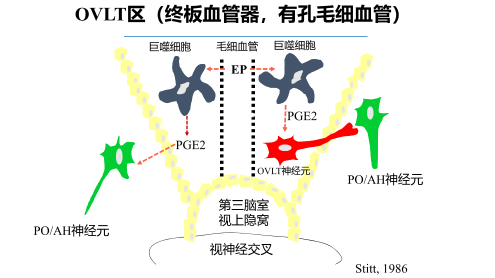

# 发热的原因和机制
## 过热与发热
- 过热 过度产热/散热障碍/中枢功能障碍导致的被动性体温升高 **体温调定点不改变**
- 发热 体温调定点上升导致的体温上升
## 发热激活物 pyro-genic activators 能激活产EP的细胞产生和释放EP的物质
- 微生物及其产物
- 非微生物发热激活物
  - 抗原抗体复合物
  - 无菌性炎症
    - 手术
    - 梗死
    - 尿酸盐/硅酸盐
  - 致热性类固醇
    - 本胆烷醇酮
## 内生性致热源 endo-genous pyrogen EP 产EP细胞在发热激活物刺激下产生和释放的能引起体温升高的物质
- IL-1 在PO/AH中密度最大
- IL-6
- TNF
- IFN
## EP升高体温调定点的机制
### 体温调节中枢的构成
- 正调节中枢
  - 视前区-下丘脑前部PO/AH
    - 冷敏神经元
    - 热敏神经元
- 负调节中枢 释放中枢解热介质
  - 中杏仁核 MAN
  - 腹中隔 VSA
  - 弓状核 
### EP信号传入体温调节中枢的假定路径
#### 经血脑屏障直接进入
#### 通过OVLT区
- 
#### 刺激迷走神经
### 中枢发热介质 引起调定点上升的最终物质
#### 正调节介质（发热） 
- PGE 
- cAMP
- CRH 
- $Na^+/Ca^{2+}$
- NO 
#### 负调节介质（解热）
- 精氨酸加压素 AVP
- 黑素细胞刺激素 $\alpha-MSH$
- 膜连蛋白A1
#### 发热的基本环节
## 发热的时相及其热代谢特点
### 热相
####
- 体温上升期
- 高热持续期
- 体温下降期
#### 体温上升期增加产热的来源
- 寒战
- 代谢率上升
- 棕色脂肪组织分解
#### 体温下降机制
- 体温调定点<中心性体温
  - PO/AH热敏神经元 +
    - 体表血管扩张，排汗
  - PO/AH冷敏神经元 -
    - 产热 $\downarrow$
### 热型
- 稽留热 高热持续不退，昼夜温差不超过1$^\circ C$
- 驰张热 高热持续不退，昼夜温差超过1$^\circ C$
- 间歇热 发热期与无热期交替出现，间歇时间短
- 回归热 发热期与无热期交替出现，持续时间大致相等
- 波状热 体温逐渐上升至39$^\circ C$以上，数天后又下降至正常水平，持续数天后又逐渐升高
- 消耗热 长期发热，昼夜温差超过4-5 $^\circ C$
## 发热反应中机体的功能和代谢变化
### 代谢变化
- 脂肪分解 酮症
- 脱水，VBVC消耗
### 功能变化--交感兴奋
- CNS
- 循环
- 免疫
- 消化
- 呼吸
- 泌尿
