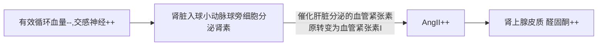
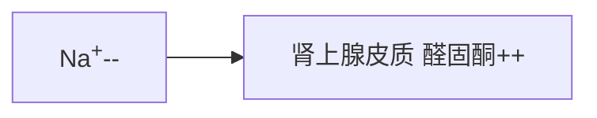
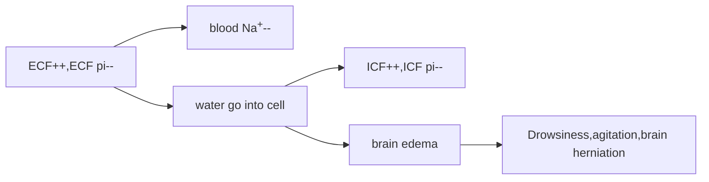
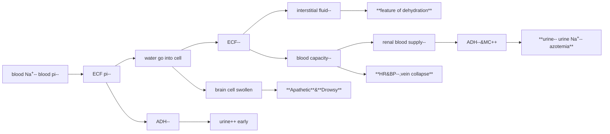

# 概述
## 体液body fluid的分布
## 体液的渗透压
- 晶体渗透压 crystalloid osmotic pressure 由电解质产生的渗透压
- 胶体渗透压 colloid oncotic pressure 由蛋白质产生的渗透压
- 胶体渗透压：血浆>组织间液，晶体渗透压：两者相同
## 体液中的电解质
- 细胞外液ECF $Na^+\hspace{0.1cm}K^+ Cl^- HCO_3^-$
- 细胞内液ICF $Mg^+ K^+ Pr^-(protein) HPO_4^{2-}$
## 水的移动
# 水钠代谢的调节
## 水的调节--渴觉中枢
### 血浆晶体渗透压 $\uparrow$
- 渴觉中枢神经细胞脱水，渴觉中枢兴奋
- 脑脊液中$Na^+$浓度增高时，刺激终板血管器中的钠感受器，刺激口渴
### 血容量 $\downarrow$(>15%)
- 左心房和胸腔大静脉处的容量感受器，颈动脉窦主动脉弓的压力感受器刺激渴觉中枢
### 血管紧张素II $\uparrow$
- AngII与第三脑室前壁的穹窿下部的AngII受体结合，刺激口渴
## 水的调节--抗利尿激素ADH/血管升压素AVP 
###
- 主要由下丘脑的视上核SON和丘脑视旁核PVN合成
- 由神经轴突输送至脑下垂体后叶储存
- ADH通过ADH磷酸化水通道蛋白AQP2促进水的重吸收
- 作用于外周血管平滑肌细胞，使其收缩增压
### 血浆晶体渗透压$\uparrow$
- 渗透压感受器细胞渗透性脱水-->ADH释放
### 血容量$\downarrow$(>15%)
- 血容量不足-->容量感受器核压力感受器的刺激作用$\downarrow$-->迷走神经对视上核的抑制$\downarrow$-->ADH释放
### 血管紧张素$\uparrow$
- AngII-->ADH release
## 钠的调节--醛固酮/盐皮质激素
### 
- 肾上腺皮质球状带分泌的盐皮质激素
- 在远曲小管和集合管中能够间接使钠钾泵活性提高
- 保$Na^+$排$K^+$
- 保$Na^+$排$H^+$
### 肾素/血管紧张素II(AngII)/醛固酮系统

### 血$K^+$和血$Na^+$改变

## 心房利钠肽ANP
### 
- 合成并贮存于心房肌细胞中
- 作用机制
  - 拮抗肾素/血管紧张素/醛固酮系统的作用
  - ANP与其受体结合，通过cGMP途径封闭钠通道，远曲小管对$Na^+$重吸收$\downarrow$
  - 选择性松弛入球动脉，收缩出球动脉，增加肾小球滤过分数

# 水钠代谢紊乱
## 水过多water excess<-->access
### 水肿 edema
#### 概述
- 等渗性体液在组织间隙或体腔内蓄积
- 体液在体腔内蓄积称为积水hydrops
- 皮下水肿称为浮肿
- 分类
  - 按原因
    - 心性
    - 肝性
    - 肾性
    - 炎性
    - 过敏性
    - 特发性
  - 按部位
    - 皮下水肿
    - 喉头水肿
    - 肺水肿
    - 脑水肿
  - 按范围
    - 局部性
    - 全身性
  - 按状态
    - 显性水肿frank edema
    - 隐形水肿recessive edema
  - 习惯
    - 积水
      - 腹腔积水
      - 胸腔积水
    - 浮肿
#### 水肿发生的机制
##### 组织间液生成增多 组织液生成>淋巴回流的代偿能力
###### 毛细血管流体静压$\uparrow$
- 全身/局部静脉压$\uparrow$
  - 静脉受压，门脉高压，静脉回流受阻
###### 血浆胶体渗透压$\downarrow$
- 血浆白蛋白浓度$\downarrow$
###### 微血管通透性$\uparrow$--组织液胶体渗透压$\uparrow$
- 炎症
- 变态反应
- 缺氧
- 酸中毒
###### 淋巴回流受阻
- 淋巴管阻塞
- 淋巴管痉挛
- 淋巴泵功能障碍
- 治疗
  - 压迫治疗
  - 淋巴管-静脉吻合
##### Na^+^，水滞留
###### 正常情况
- Na^+^和水的摄入量与排出量处于动态平衡（受肾调节）
- 球-管平衡 肾小球的滤过和肾小管的重吸收作用维持Na^+^和水的平衡
- $有效滤过压=肾小球毛细血管血压-(血浆胶体渗透压+肾小球囊内压)$
###### 肾小球滤过率下降 decreased glomerular filtration rate
- 肾小球滤过面积$\downarrow$
  - 急/慢性肾小球肾炎
- 肾血流量$\downarrow$
  - heart failure/shock
  - 有效循环血量$\downarrow$
    - 交感/肾上腺髓质系统and肾素/血管紧张素系统$\uparrow$
      - 入球小动脉收缩
        - 肾血流量进一步$\downarrow$
          - 肾小球滤过率$\downarrow$
- 有效滤过压$\downarrow$
###### 肾小管重吸收增加 increased tubular resorption
- 有效循环血量$\downarrow$
  - 醛固酮/ADH $\uparrow$
  - ANP $\downarrow$
  - 静水压
- 肝功能障碍
  - 醛固酮/ADH灭活能力$\downarrow$
    - 抗利尿
###### 肾内血流重新分布
- 正常
  - 约有90%肾血流通过皮质肾单位
    - 皮质肾单位髓袢短，钠水重吸收能力弱
    - 近髓肾单位髓袢长，深入髓质高渗区，对钠水重吸收能力强
- 异常
  - 有效循环血量$\downarrow$
    - 皮质肾单位血管强烈收缩，近髓肾单位血管收缩轻
#### 常见全身性水肿
- 心性水肿 cardiac edema
  - 左心衰 心源性肺水肿
  - 右心衰 心性水肿
- 肾性水肿 renal edema
- 肝性水肿 hepatic edema
- 炎性水肿 inflammatory edema
- 营养不良性水肿 nutritional edema
#### 水肿防治原则
##### 防治原发病
- 心力衰竭
- 肾病综合症
- 肝硬化 血浆白蛋白$\downarrow$，ADH，醛固酮$\uparrow$
##### 对症处理
- 全身水肿
  - 利尿剂，限制钠水摄入
- 脑水肿
  - 强效利尿剂
  - 糖皮质激素 降低微血管壁通透性，稳定细胞膜
- 急性肺水肿
  - 利尿剂
  - 扩血管药物
### 水中毒 water intoxication
####
- 低渗性体液在体内潴留
- 高容量性低钠血症 hyper-volemic hypo-natremia
#### 发病原因
##### 肾排水$\downarrow$
- 急/慢性肾功能障碍少尿期
- 有效循环血量$\downarrow$
  - 心衰
- 肝硬化
- 肾血流量$\downarrow$
##### ADH分泌增多
- 肾上腺皮质功能低下
  - 皮质醇/糖皮质激素cortisol分泌$\downarrow$，对下丘脑分泌ADH抑制$\downarrow$
- ADH分泌异常增多综合征
  - 下丘脑源性 脑部病变
  - 非丘脑源性 恶性肿瘤
- 外源性ADH
  - 加压素
  - 催产素
##### 入水过多
- 低渗性脱水后期输注大量水分
- 幼龄动物水和电解质的调节功能尚未成熟，入水过多
##### 盐皮质激素分泌增多
##### 利尿激素分泌过少
- ANP
#### 影响
##### 

#### 防治
- 预防
- 限水
- 利尿
- 转移 小剂量高渗盐水
### 盐中毒 salt intoxication
####
- 高渗性体液在体内潴留
- 高容量性高钠血症 hyper-volemic hyper-natremia
#### 发病原因
- 盐摄入过多
  - 猪食盐中毒
  - 过量输注高渗盐水/碳酸氢钠溶液
- 原发性钠潴留
  - 原发性醛固酮增多症
#### 对机体的影响
- 细胞脱水
- 中枢功能障碍 神经细胞脱水
## 脱水 de-hydration
###
- 细胞外液容量减少(>2%)
- 水和电解质同时丧失
### 高渗性脱水 hyper-tonic
#### 发生原因
##### 摄入不足
- 水源断绝
- 进食困难
- 丧失渴感（老龄动物）
##### 丢失过多
- 单纯性失水
  - 皮肤不感蒸发 发热，甲亢
  - 尿崩症 ADH反应缺乏
  - 呼吸道失水 过度通气
- 失水>失Na^+^
  - 剧烈呕吐/腹泻 低渗性体液丢失
  - 渗透性利尿 反复使用甘露醇/高渗葡萄糖
#### 影响
- 脱水热
- 幻觉/躁动
- 尿
  - 早期 尿少，比重高
  - 后期 尿钠含量降低
#### 临床特点
- 口渴，少尿（后期尿钠下降，尿比重降低）
- 细胞皱缩
- 血液黏稠，循环衰竭
- 酸中毒（细胞内脱水，细胞内氧化酶活性降低，酸性代谢产物堆积）
- 脱水热
- 大脑皮质/皮质下中枢机能紊乱，运动失调，昏迷甚至死亡
#### 防治的病理生理基础
- 及时补水
- 适当补$Na^+$,$K^+$
### 低渗性脱水 hypo-tonic
#### 
- 钠流失>水流失
- 低容量性低钠血症 hypo-volemic hypo-natremia
#### 原因
- 补液不当 体液大量流失后，单纯性补水
  - 呕吐
  - 腹泻
  - 大出血
  - 大面积烧伤
- 钠随尿丢失
  - 肾上腺皮质功能低下 醛固酮$\downarrow$
  - 长期使用利尿剂
    - 速尿
    - 利尿酸
    - 氯噻嗪
  - 肾脏疾病-->尿浓缩$\downarrow$
#### 影响
##### 肾外性

##### 肾性
- 尿钠$\uparrow$
##### 脱水征 因组织间液减少，临床上出现皮肤弹性减退，眼窝下陷
#### 临床特点
- 早期出现多尿和低渗尿
- 细胞水肿
- 低血容量性休克
- 自体中毒
#### 防治
- 轻/中度 补生理盐水
- 重度 补高渗盐水
- 忌补5%葡萄糖 代谢后相当于补纯水，加重病情
### 等渗性脱水 iso-tonic
####
- 失水=失钠
- 低容量血症 hypovolemia
#### 原因
##### 等渗液丢失 lost isotonic fluid
- 胃肠道丢失 gastro-intestinal losses
  - 肠梗阻
  - 呕吐
  - 腹泻
- 腹ascites/胸pleural水
- 皮肤丢失 大面积烧伤
#### 影响
- 血浆渗透压变化和血钠变化
  - n
- 激素水平变化
  - MC++
#### 防治
- 补水量>补钠量 肾脏排钠负担？
- 宜补充生理盐水(1/2~2/3) & 5%Glc

# 钾代谢障碍
## 生理功能
## 低钾血症 hypo-kalemia
### 发生原因
#### 钾摄入不足
#### 钾丢失过多
- 经消化道丢失
   - 消化道丢失
  - 高位肠梗阻
    - 含钾消化液随呕吐流失
    - 流失胃酸导致代谢性碱中毒，为纠正代谢性碱中毒，保留H^+^的同时维持Na^+^的重吸收，钠钾泵活动增强，加速钾的排泄
    - 细胞内外H^+^K^+^的交换
- 经肾丢失
  - 大量利用利尿剂
  - 肾脏疾病
    - 急性肾衰
    - 肾盂肾炎
  - 低镁血症
    - ROMK通道开放
    - 钠钾泵活性降低，钾难以泵入细胞，血钾++，钾重吸收--
#### 钾向细胞内转移
- 碱中毒
- 细胞内合成代谢增强
- 中毒 阻断钾通道，抑制细胞内钾外流
  - 棉酚中毒
  - 钡中毒
- 低温 钾进入细胞内
### 病理生理改变
#### CNS
- 中枢抑制
- 嗜睡
- 昏迷
#### 神经肌肉
- acute 胞外K^+^<<胞内K^+^
  - 超极化，兴奋性$\downarrow$
    - 肌无力
  - 横纹肌溶解
- chronic 内外K^+^平衡 
  - 对神经肌肉无影响
#### 心脏
- acute
  - Ca^2+^内流$\uparrow$ 
    - 兴奋收缩耦连$\uparrow$,心肌收缩性$\uparrow$
- severe
  - 代谢障碍
    - 细胞变性，坏死
      - 收缩性$\downarrow$
#### 慢性低血钾
- 重吸收受阻导致的多尿，尿比重下降
- Na^+^-H^+^交换$\uparrow$导致的酸尿
### 防治
- 防治原发病
- 补钾
  - 见尿补钾
  - 口服补钾
- attention
  - 急重症可静脉滴注，但应严格控制剂量和速度，以免血钾突然升高导致的心室纤颤/心搏骤停
  - 尿量过少时不宜补钾，以免高钾血症  
## 高钾血症 hyper-kalemia
### 发生原因
#### 肾排钾障碍
- 肾衰
- MC $\downarrow$
#### 细胞内钾外逸
- 溶血和组织坏死
- 组织缺氧，Na-K bump $\downarrow$，胞外钾无法泵入，胞内钾大量外流
- 酸中毒，Na-H $\uparrow$ Na-K $\downarrow$ K排出$\downarrow$
#### 病理生理改变
##### 对神经肌肉
- mild
  - 肌肉兴奋性增强，肌肉轻度震颤
- severe
  - 电位过高导致钠通道失活
    - 无法产生兴奋
      - 四肢软弱无力，腱反射消失，甚至出现麻痹
##### 对心脏
- 自律性，兴奋性，传导性，收缩性$\downarrow$
##### 代谢性酸中毒
#### 防治 
- 治疗原发病
- 促进K^+^转入细胞内
  - 静注葡萄糖&胰岛素，促进糖原合成
  - 输注碳酸氢钠，促进H^+^-K^+^交换
- 对抗高钾对心肌的毒性
  - 静注葡萄糖酸钙以提高血钙
  - 静注NaCl，增高血钠浓度，增强动作电位
- 加速K^+^排出
  - 口服阳离子交换树脂