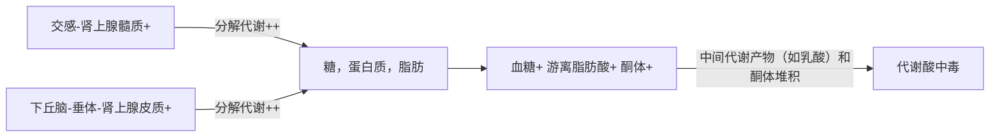
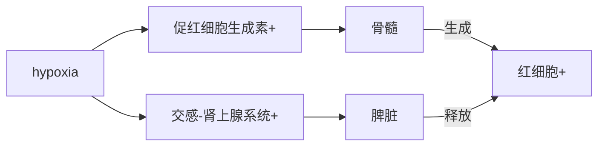

# 窒息 asphy-xia/asphy-xiation a condition of severely deficient supply of oxygen to the body that arises from abnormal breathing
# 血氧指标 parameters for blood oxygen
## 血氧分压 partial pressuref of oxygen,PO~2~
### 动脉血氧分压 PaO~2~ 
- 反映外呼吸功能和吸入气体的氧分压
- 97-100mmHg
### 静脉血氧分压 PvO~2~
- 反映内呼吸功能
- 40mmHg
## 血氧含量 oxygen content,CO~2~
- 100mL血液中，与血红蛋白（Hb）结合的氧+溶解在血浆中的氧：评价呼吸功能
- 正常值
  - CaO~2~ 19mL/dL
  - CvO~2~ 14mL/dL
## 血氧容量 oxygen binding capacity of hemoglobin,C-O~2max~
- $T=38^\circ C$ ，PO~2~=150mmHg，PCO~2~=40mmHg，体外100mL血液中Hb所结合的最大氧量
- 反映血液的携氧能力
## 血氧饱和度 oxygen saturation SaO~2~
- 血红蛋白结合氧的百分数=（血氧含量-物理溶解氧）/血氧含量x100%
- artery95% vein75%
## 氧离曲线 oxygen dissociation curve,ODC
- 氧饱和度与氧分压之间的关系
## 动静脉氧差
- CaO~2~-CvO~2~
- 反映组织对氧的利用能力
- 病理变化
  - 淤血 动静脉氧差 ++
  - 血红蛋白与氧亲和力升高（氧离曲线左移） 氧气难以逸出到组织 动静脉氧差 --
## P~50~
- 血氧饱和度为50%时的氧分压
- 反映Hb与O~2~的亲和力
- 病理变化
  - 氧离曲线右移 P~50~ ++
    - 2,3-BPG
    - t $\uparrow$
    - $CO_2 \uparrow H^+ \uparrow$
  - 氧离曲线左移

# 缺氧的类型及原因
##

## 乏氧性缺氧 hypo-tonic张力减退的，低渗的(低氧分压的) hypo-xia/外呼吸性缺氧/低张性缺氧

### 肺泡内氧分压降低，血液从肺泡内摄取的氧减少，不能满足机体需要
### 发生原因 cause
#### 空气中氧分压低
#### 外呼吸机能障碍（肺通气和肺换气障碍）
#### 静脉血分流入动脉
##### 卵圆孔未闭/室间隔缺损 --> 右心静脉血不经过肺循环直接流入左心，进入组织
#### 通气与血流不一致
### 血气变化 blood gas changes
####
<table>
    <thead>
        <tr align="center">
            <td>PaO2</td>
            <td>SaO2</td>
            <td>O2 capacity</td>
            <td>CaO2</td>
            <td>CaO2-CvO2</td>
    </thead>    
    <tbody>
        <tr align="center">
            <td>--</td>
            <td>--</td>
            <td>n or ++</td>
            <td>--</td>
            <td>--(acute)</td>
        <tr>
    </tbody>
</table>

#### 相关症状
##### 发绀 cyan-osis 脱氧Hb > 5g/100mL
- 心力衰竭 慢性缺氧 发绀
- 真性红细胞增多症 不缺氧 发绀
- 贫血 缺氧 不发绀 

## 等张性缺氧 iso-tonic等张的（氧分压与正常值相等的） hypo-xia/血液性hemic 缺氧

### 发生原因 cause
#### Hb减少（红细胞比容<20%）
- 贫血
  - 再生障碍性贫血
  - 营养不良性贫血
  - 出血性贫血
  - 溶血性贫血
#### CO中毒
- CO与Hb结合-->大量Hb失去携氧能力-->组织缺氧（***樱桃红色***）
#### 高铁血红蛋白血症 
- 亚硝酸盐，过氯酸盐，磺胺类药物中毒-->Hb中Fe^2+^转变为Fe^3+^-->携氧能力下降-->组织缺氧（***血液为深咖啡色，滴加KCN时变红***）
#### 血红蛋白与氧的亲和力异常增强
- 大量输入库存血液(2,3-BPG降解)/碱性液体，环境低温-->氧离曲线左移
### 血气变化 blood gas changes
####
<table>
    <thead>
        <tr align="center">
            <td>PaO2</td>
            <td>SaO2</td>
            <td>O2 capacity</td>
            <td>CaO2</td>
            <td>CaO2-CvO2</td>
    </thead>    
    <tbody>
        <tr align="center">
            <td>n</td>
            <td>n</td>
            <td>n or --</td>
            <td>n or --</td>
            <td>--</td>
        <tr>
    </tbody>
</table>

#### 贫血：血氧容量--，CaO~2~--
#### CO中毒：血氧容量正常，CaO~2~正常
#### Hb与O~2~亲和力++ --> 缺氧：CaO~2~n,SaO~2~,SvO~2~

## 循环性缺氧 circulatory hypoxemia 

### 血液循环障碍-->供给组织的血液减少
- 动脉供血不足：缺血性缺氧 ischemic hypoxia
- 静脉回流受阻： 淤血性缺氧 stagnant hypoxia
### 发生原因
#### 全身性血液循环障碍
- 心衰 congestive heart failure
- 休克 shock
#### 局部性血液循环障碍
- 局部淤血 local congestion
- 血栓形成及栓塞 thrombosis & embolism
- 梗死 infraction
### 血气变化
####
<table>
    <thead>
        <tr align="center">
            <td>PaO2</td>
            <td>SaO2</td>
            <td>O2 capacity</td>
            <td>CaO2</td>
            <td>CaO2-CvO2</td>
    </thead>    
    <tbody>
        <tr align="center">
            <td>n</td>
            <td>n</td>
            <td>n</td>
            <td>n</td>
            <td>++(血流缓慢导致弥散到组织的O2++)</td>
        <tr>
    </tbody>
</table>

#### 淤血性缺氧：脱氧Hb增加，可视粘膜发绀
#### 缺血性缺氧：组织苍白

## 组织性缺氧 histo-genous hypoxia
###

### 组织细胞对氧的利用异常
### cause
- 细胞中毒 CN^-^
- 线粒体损伤
  - 细菌毒素
  - 热射病
  - ROS
- 呼吸酶合成障碍 VB1，VB2，尼克酰胺缺乏-->呼吸酶合成减少-->生物氧化过程障碍
### blood gas changes
####
<table>
    <thead>
        <tr align="center">
            <td>PaO2</td>
            <td>SaO2</td>
            <td>O2 capacity</td>
            <td>CaO2</td>
            <td>CaO2-CvO2</td>
    </thead>    
    <tbody>
        <tr align="center">
            <td>n</td>
            <td>n</td>
            <td>n</td>
            <td>n</td>
            <td>--++)</td>
        <tr>
    </tbody>
</table>

#### 动静脉氧差--（需氧过多引起的例外）
#### 氧不能被细胞利用，HbO~2~增加，血液呈鲜红色，可视黏膜呈鲜红色/玫瑰红色

## 细胞病理性缺氧 Cyto-pathic hypoxia 
- 败血症 sepsis
- 全身炎症反应综合征 systemic inflammatory response syndrome SIRS

# 缺氧对机体的影响
## 代谢改变

## 器官功能改变
### 呼吸系统
#### 急性肺水肿 
- 呼吸困难，皮肤紫绀
#### 中枢性呼吸衰竭：呼吸抑制，通气量减少
### 循环系统
- 皮肤，黏膜，腹腔脏器血管收缩 外周阻力增加，维持血压，保证器官的灌注压
- 心脑血管扩张 保证重要器官的代谢
- 肺血管收缩 调整肺内血流与通气量的比例，获得较高的PaO~2~
- 毛细血管增生（chronic） 毛细血管密度增加，缩短氧弥散至细胞的距离，增加供氧
### 血液系统
#### Hb++

#### 氧离曲线右移，血液携氧能力-- 
  - 缺氧--> 2,3-BPG++ --> 血液携氧--
  
