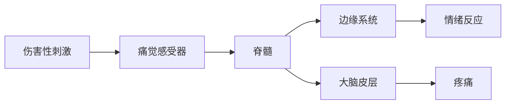

# 镇静药和安定药
## CNS
## 神经元结构与连接
- 神经元 neuron
- 神经胶质细胞
  - 分类
    - 原浆性星形胶质细胞
    - 纤维性星形胶质细胞
    - 小胶质细胞
    - 少突胶质细胞
  - 功能
    - 支持，滋养神经元
    - 吸收和调节
    - 绝缘
## 突触 synapse
## 血脑屏障
## CNS与传出神经系统作用的异同
### 不同点
- CNS **神经元之间**的直接/间接作用，涉及受体较多
- 传出 **神经元**-**外周效应器**，涉及受体少
### 相同点
- 神经递质及其受体
  - Ach
  - NE
  - DA
  - Glu
  - GABA
## 中枢神经递质及其相应受体 见表
- Ach
  - 神经元分布
  - 功能
  - 脑内受体
- NE
  - 神经元分布
  - 功能
- DA 
  - 神经元分布
  - 功能
  - 脑内受体
- Glu
  - 神经元分布
  - 功能
  - 脑内受体
- GABA
  - 神经元分布
  - 功能
  - 脑内受体
## 中枢神经系统药理学特点
### 中枢兴奋药
- 欣快
  - 失眠
    - 不安
      - 幻觉
        - 妄想
          - 躁狂
            - 惊厥
### 中枢抑制药
- 镇静，催眠，抑郁，麻醉，昏迷
## 药物种类
### 中枢特异性药物
- 作用受体/递质/特殊部位（边缘系统，黑质-纹状体等）
- 有竞争性拮抗剂/特效解毒药
- 不一定局限
### 中枢非特异性药物
- 影响神经细胞能量代谢/膜稳定性
- 量效关系
  - 作用强度增加
  - 作用范围扩大
- 无竞争性拮抗药/特效解毒剂
### 大多数中枢药属特异性药
## 影响药物作用强度核持续时间的因素
- BBB
- 药物的理化性质
- 药物的生理学作用
## 分类
### 镇静药和安定药
#### 概念
- 镇静药 sedative 是能对中枢神经系统产生抑制作用，从而减弱活动，调节兴奋性，消除躁动不安和恢复安静的药物
  - hypnitic 催眠药
  - include **苯二氮卓类** **巴比妥类** **水合氯醛**
- 安定药 tranquilizer/ataractic 缓解焦虑而又不产生过度镇静的药物
  - 轻度安定药/抗焦虑药 **苯二氮卓类**，**丁螺环酮**
  - 深度安定药/神经松弛剂/抗精神失常药 阻断CNS中DA介导的反应，使激动的动物安静下来，并能调节/控制他们的行为或精神病态 **酚噻嗪类**，**丁酰苯类**
#### 镇静药作用的特点
- 巴比妥类随剂量增加依次呈现镇静，催眠，麻醉，昏迷的作用，而苯二氮卓类呈现镇静催眠作用
- 耐受性
- 习惯性
- 成瘾性
#### 药物 见表
##### 镇静药
- 吩噻嗪类
  - 机制 阻断 中脑-边缘系统 和 中脑-皮层系统D2样受体
- 苯二氮卓类
  - 机制 增强GABA作用，抑制中枢
    - GABA作用于$Cl^-$通道，使其开放，$Cl^-$内流，细胞超极化导致抑制效应
  - 药理作用
    - 抗焦虑 小剂量选择性抑制边缘系统，用于狂躁动物的安静与保定 
      - 地西泮
    - 镇静催眠
      - 麻醉前给药
    - 抗惊厥
      - 治疗破伤风，高热惊厥，子痫，药物中毒性抽风
      - 癫痫持续状态的首选药是地西泮
    - 中枢性肌松作用
      - 缓解大脑损伤导致的肌肉僵直
  - 药动学
    - 吸收
      - 内服吸收快，完全
      - 肌肉注射吸收不稳定
    - 分布
      - 高度亲脂（进入神经），弱碱性
      - 血浆蛋白结合率高
    - 代谢
      - 肝内代谢
      - 地西泮经肝药酶代谢产生去甲地西泮（仍有活性）
      - 部分进入肝肠循环
    - 排泄
      - 尿，粪
- 丁酰苯类
  - 作用机理 阻断D2/α/M受体
  - 主要药物 氮哌酮，氟哌利多，氟苯哌丁酮
  - 作用 镇静，降低运动机能和安定等作用
  - 应用
- 肾上腺素能α2受体激动剂
  - 作用机理
    - 激活突触前膜和突触后膜上的α2受体，产生血管收缩，血糖升高（胰岛素释放抑制），交感神经功能低下
  - 代表药物 塞拉嗪，地托咪啶，塞拉唑
  - 作用
    - 强效镇静，催眠
    - 镇痛，肌松和局麻
- 醛类
- 巴比妥类
- 硫酸镁注射液
### 镇痛药
#### 疼痛
##### 
- 疼痛是一种复杂的主观感觉，是机体受到伤害后发出的一种保护反应，常伴有不愉快的情绪反应
  - 锐痛（快痛）
    - 定位 清楚，尖锐
    - 原因 严重创伤，烧伤，心梗
    - 传导纤维 A和σ有髓
    - 兴奋阈 低
  - 钝痛（慢痛）
    - 定位 不明确，烧灼痛
    - 原因 感染性炎症，腹痛，牙痛
    - 传导纤维 C和f无髓
    - 兴奋阈 高
##### 

#### 缓解疼痛药物分类（用途）
- 镇痛药
  - 作用于CNS，选择性抑制或消除痛觉，减轻由疼痛引起的紧张，焦虑等情绪，不影响意识
  - 为麻醉性镇痛药（成瘾性镇痛药），镇痛作用强大，反复用易成瘾
  - 代表药 吗啡
- 解热镇痛抗炎药
  - 抑制体内PGE生物合成，镇痛作用较弱，同时兼有解热，抗炎作用
  - 用于各种钝痛，无成瘾性
- 局麻药，全麻药，抗抑郁药
#### 麻醉性镇痛药 narcotic analgesics/阿片样镇痛药 opioid analgesics
- 具有吗啡样选择性作用于CNS，减轻/缓解疼痛感觉的一类药物
- 作用机理 作用于中枢神经组织内的阿片opium受体，选择性的抑制某些兴奋性神经的冲动传递，激动阿片受体，激活体内的抗痛系统，阻断痛觉传导，产生中枢性镇痛作用
- 特点
  - 镇静，强烈镇痛，欣快
  - 明显抑制呼吸
  - 成瘾性/依赖性
##### 阿片类镇痛药
- 阿片opium，含有二十余种生物碱
  - 菲类
    - 吗啡，可待因
    - 镇痛作用
  - 异喹啉类
    - 如罂粟碱 
    - 平滑肌松弛，舒张血管
- 阿片受体 opium receptor
  - G蛋白偶联受体家族
  - 亚型
    - μ 镇痛，呼吸抑制，欣快感，药物依存
    - δ 精神活动
    - κ 镇痛，缩瞳，镇静
    - σ 致幻作用
- 脑内阿片受体分布及其作用 见表
- 内源性阿片样活性物质
  - 内源性阿片样肽（内阿片肽）
    - 脑啡肽：蛋氨酸脑啡肽，亮氨酸脑啡肽
    - α-内啡肽，β-内啡肽，γ-内啡肽和强啡肽
    - 外周
  - 调控痛觉感受/内源性镇痛系统
  - 调节心血管及胃肠功能等的作用
- 阿片受体激动药 见表
### 全身麻醉药
#### 麻醉 anesthesia
- 定义：感觉消失，亦即用药物/非药物方法使病人整个机体/机体某一部分暂时丧失对疼痛的感觉，称为麻醉
- 分期
  - 第一期：镇痛期（随意运动期）
    - 从麻醉给药开始，到意识消失为止
    - 网状结构上行激活系统&大脑皮层抑制
    - 痛觉-触觉-听觉依次消失，角膜，眼睑，皮肤，吞咽，咳嗽等反射均存在
  - 第二期：兴奋期
    - 从意识丧失开始
    - 大脑皮层抑制功能加深，皮层下中枢失去皮层的控制于调节
    - 不随意性运动型性兴奋，嘶鸣，挣扎，呼吸极不规则，瞳扩，骨骼肌张力增加，角膜，眼睑，皮肤，吞咽，咳嗽等反射均存在
    - 不宜进行任何手术
    - 前两期合称为诱导期
  - 第三期：外科麻醉期
    - 从兴奋转为安静，呼吸转为规则开始，麻醉进一步加深，大脑，间脑，中脑，脑桥依次被抑制，脊髓机能由后向前逐渐抑制，但 **延髓中枢机能仍保持**
    - 瞳缩，肌张力降低，眼睑角膜反射存在，其他反射消失
    - 可分深麻浅麻，一般在浅麻手术
  - 第四期：麻痹期
    - 呼吸肌完全麻痹至循环完全衰竭为止
- 复合麻醉方式
  - 麻前给药
    - 氯丙嗪：中枢抑制，镇吐，增强麻醉
    - 阿托品：抑制腺体分泌，抑制胃肠道蠕动和分泌，阻断迷走对心脏的影响
  - 诱导麻醉和维持麻醉
    - 硫喷妥钠/氧化亚氮（笑气）使动物迅速进入外科麻醉期，然后改用其他麻醉药物维持麻醉
  - 基础麻醉
    - 先用巴比妥类/水合氯醛使动物进入浅麻，再在此基础上用其他药物麻醉
  - 配合麻醉
    - 局麻/其他药配合全麻
  - 混合麻醉
    - 两种以上药物配合进行麻醉
    - 水合氯醛+硫酸镁
#### 药物
##### 吸入麻醉药/挥发性麻醉药
- 机制
  - GABA+
  - Glu-
- 应用
  - 全身麻醉的诱导和维持
  - 亚麻醉浓度用于震惊和镇痛
- 优点
  - 易控制麻醉深度，安全性好
  - 需要设备，有些麻醉药易燃易爆，刺激呼吸道
- 药动
  - 吸收
    - 最小肺泡浓度MAC 能使50%动物对标准疼痛刺激不再产生反应时的肺泡气体中麻醉药浓度，单位为溶剂Vol%
  - 分布
    - 脂溶性，易通过血脑屏障
    - 血/气分布系数：指血中药物浓度与吸入气中药物浓度达到平衡的比值
  - 消除（代谢和排泄）
    - 原形经呼吸道排出体外
    - 脑/血分布系数：脑中药物浓度与血药浓度达到平衡的比值
  - 溶解性
    - 易溶：乙醚，甲氧氟烷 诱导期长，清醒慢
    - 中等溶解度：氟烷，安氟醚，异氟醚等
    - 难溶：氧化亚氮 诱导期短，清醒快
- 药物 见表
##### 静脉麻醉药
- 体内过程
  - 药物作用快慢，强度，脂溶性有关
     - 脂溶性大-易透过血脑屏障-作用快而强
     - 硫喷妥>戊巴比妥>苯巴比妥
  - 药物维持时间长短与药物消除的方式有关
- 巴比妥类作用机制
  - $GABA_A$受体-氯离子通道-苯二氮卓受体复合体
    - 模拟GABA作用，开放氯离子通道，引发超极化
  - 在镇静催眠剂量，选择性抑制脑干网状结构上行激动系统
  - 麻醉浓度抑制电压依赖性$Na^+$通道
- 药物 见表